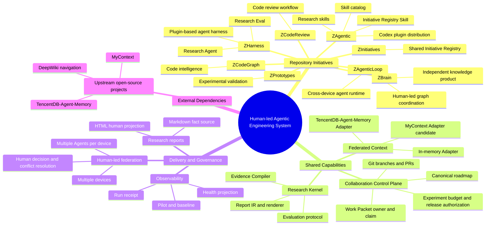
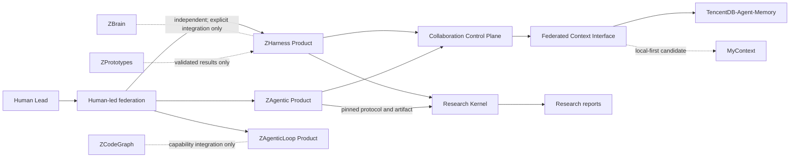

# 全局 Initiative Landscape

## 用途

本文是跨仓库关系图，回答“我们正在建设哪些相互关联但独立演化的 Initiative”。[global initiative roadmap](plans/global-initiative-roadmap.json) 按 `Initiative → Spec → Plan` 提供导航；施工状态、决策和证据归各 Plan Node 指向的 roadmap-plan-file。

这里使用 **Initiative** 代替“项目线/产品线”：它表示一个持续演化、有明确目标和责任范围的建设方向。Initiative 可以是 Product，也可以是被多个 Product 复用的 Shared Capability 或治理方向，因此比“产品线”更准确。

## 全局思维导图

## Initiative 分类

| Initiative | 类型 | 自有仓库 | 主要责任 | 不负责 |
|---|---|---|---|---|
| ZHarness | Product | `jununfly/ZHarness` | 可运行的 plugin-based agent harness、Research Agent、research-eval host 和运行协议 | Skill 资产发行、个人知识产品 |
| ZAgentic | Product | `jununfly/ZAgentic` | 可复用 skills、Codex plugin、研究流程资产和跨设备分发 | Agent runtime、集中共享 memory runtime |
| ZInitiatives | Shared Capability | `jununfly/ZInitiatives` | 跨 Initiative 的 Registry 数据、协议和生成物 | Skill 执行逻辑、各 Initiative 的 PRD/Plan 内容 |
| ZAgenticLoop | Product | `jununfly/ZAgenticLoop` | Human-led graph coordination、跨设备协作和原生 Agent runtime | 通用 Agent harness、Skill 发行 |
| ZBrain | Product | `jununfly/ZBrain` | 独立知识产品及其自身 roadmap | 混入其他 Initiative 的执行状态 |
| ZCodeGraph | Product | `jununfly/ZCodeGraph` | Code intelligence 与索引能力 | Agent 协作控制面 |
| ZCodeReview | Product | `jununfly/ZCodeReview` | Code review 工作流与评审能力 | 通用 Agent runtime |
| ZPrototypes | Experimental Initiative | `jununfly/ZPrototypes` | 有界原型和方案验证 | 长期产品事实源 |
| Research Kernel | Shared Capability | ZHarness 实现，ZAgentic 固定版本消费 | commit-pinned evidence、Report IR、Markdown/HTML 编译和评估协议 | 选定 Human 决策、替代报告调用入口 |
| Collaboration Control Plane | Shared Capability | ZHarness/ZAgentic 分工 | Work Packet、owner、claim、roadmap、预算、发布和审计 | 保存所有对话或替代 Git |
| Federated Context | Shared Capability | 计划由 ZHarness 持有 Interface | 跨设备共享 memory、metadata、权限检索、provenance 和 freshness | 自动裁决冲突、替代 roadmap 或发布授权 |
| Human-led federation | Operating Model | 跨仓库 | Human 领导多设备 × 多 Agent 的分工、关键决策、冲突裁决和发布 | 无人监督的自治组织 |
| Research reports | Artifact Family | ZAgentic `research/` | Markdown 事实产物及其 HTML 人类视图 | 独立 Product 或 canonical collaboration state |
| ZBrain | External Initiative | 独立 workspace | 保持其自身产品目标和 roadmap | 混入 ZHarness/ZAgentic roadmap |

## 关键依赖关系

## 防迷失规则

1. 每个新需求先归属一个 Initiative；跨 Initiative 时明确 owner 和交付 Seam。
2. Product roadmap 只记录该 Product 能控制的工作，不吸收外部 Initiative 的状态。
3. Shared Capability 只保留一个实现或协议事实源；其他仓库固定版本消费，不复制实现。
4. Artifact Family 不是 Product。Research report 是 Research Kernel 的产物，不单独承担运行、治理或状态管理。
5. 上游开源项目是 Adapter 目标或外部依赖，不自动成为自有 Product。
6. 跨设备协作以 Git、canonical roadmap 和版本化资产汇合；memory 是可检索投影，不是决策事实源。
7. 对话切换 Initiative 时先声明新的地图位置，再继续设计或施工。

## 当前导航入口

- 全局导航：[global initiative roadmap](plans/global-initiative-roadmap.json)
- ZHarness 执行路线图：`ZHarness/docs/zj/learning_roadmap.md`
- Federated Context 方案：[集成技术方案](../../ZHarness/docs/prds/federated-context.md)
- 多设备上下文调研：[评估报告](../research/multi-device-agent-context/2026-08-19-agent-context-draft.md)
- Research Agent 双路线对比：[Agent 与 skill 对比](../research/agent-harness-comparison/2026-08-18-agent-vs-skill-comparison.md)
