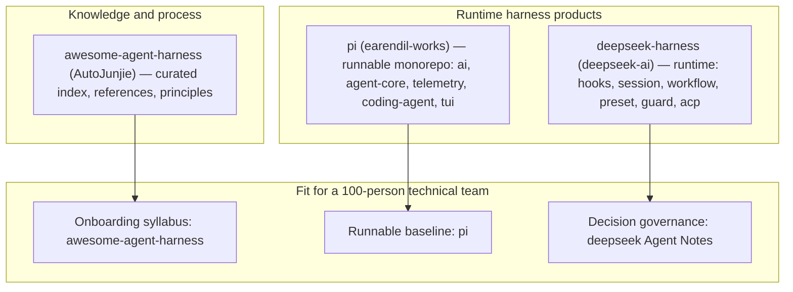
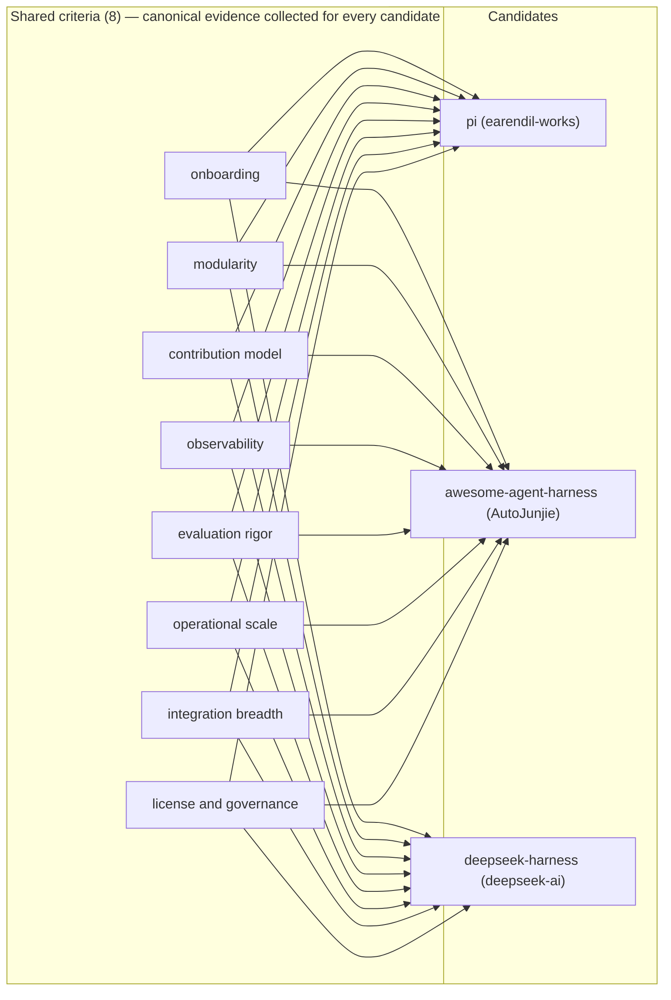

# 调研主题
Harness Engineering Approach Fit for a 100-Person Technical Team

For a one-hundred-person technical team, the evidence separates the three candidates into distinct roles: earendil-works/pi is a runnable, packaged harness (multi-provider LLM API, agent runtime, telemetry contracts, parallel tool execution) with deliberately gated external contribution intake; deepseek-ai/deepseek-harness is a runtime plus a formal decision-governance system (Agent Notes with path-encoded lifecycle, session telemetry, hook bridges, worker-thread workflows); AutoJunjie/awesome-agent-harness is a curated knowledge index and principle source, not a runtime. The strongest fit is a composite: adopt pi as the runnable baseline, use awesome-agent-harness as the onboarding and culture syllabus, and adopt deepseek-harness's Agent Note governance as the decision-record process for the team's harness evolution.

## 输入材料与观察时间
Evidence ledger: `80196bb41568e681ee097ca619ae6bd84de23abaedeab1bca1cbb23a28c68bf5`
Observed: 2026-08-18T12:59:50.146Z

## Key-Value 概念索引
- Key: `harness-engineering` — The discipline of designing everything around an LLM agent except the model — environments, constraints, tools, context delivery, feedback loops, and human oversight — so agent work is reliable at team scale. Fit for a 100-person team is judged across eight shared criteria: onboarding, modularity, contribution model, observability, evaluation rigor, operational scale, integration breadth, and license/governance.

Concepts: [[harness-engineering]]

## C4 System Landscape
### Harness engineering landscape for a 100-person team

## 候选项目表
| Repository | Stars | Topic match |
|---|---:|---:|
| earendil-works/pi | 92901 | 2 |
| AutoJunjie/awesome-agent-harness | 513 | 0 |
| deepseek-ai/deepseek-harness | 157935 | 2 |

## 深读项目卡片
### pi (earendil-works) — runnable multi-package harness
A packaged, executable harness monorepo: unified multi-provider LLM API, agent runtime with parallel tool execution, coding-agent CLI, TUI, and vendor-neutral telemetry contracts with conformance tests. Evaluation runs on real-world OSS session data published to Hugging Face. External contribution intake is deliberately gated — new-contributor issues and PRs are auto-closed and triaged daily by maintainers.

- Claim `C1`
- Claim `C2`
- Claim `C3`
- Claim `C4`
- Claim `C5`
- Claim `C6`
- Claim `C7`

### awesome-agent-harness (AutoJunjie) — curated knowledge index
A curated list and principle source for harness engineering, not a runtime. It codifies principles such as AGENTS.md-as-table-of-contents, mechanical architecture enforcement, agent legibility, and fewer expressive tools, and aggregates canonical references (Fowler, LangChain, OpenAI, Anthropic) usable as an onboarding syllabus. Prescribes humans-steer/agents-execute contribution norms with CI checks replacing review for invariants.

- Claim `C8`
- Claim `C9`
- Claim `C10`
- Claim `C11`
- Claim `C12`
- Claim `C13`

### deepseek-harness (deepseek-ai) — runtime plus decision governance
A runtime harness with hooks (Claude Code/Codex bridges plus wire protocol), durable session telemetry, identity/settings/credentials capabilities, an Agent Client Protocol server, workflow with worker-thread provider, presets, plan mode, and guard plugins. Its signature strength is decision governance: Agent Notes with a path-encoded lifecycle (proposed/implemented/rejected) and mechanically checkable cross-references, with bilingual EN/中文 guidance.

- Claim `C14`
- Claim `C15`
- Claim `C16`
- Claim `C17`
- Claim `C18`
- Claim `C19`

## 方案族及适用场景对比
### K1
Runnable product vs knowledge index: pi and deepseek-harness are executable harnesses with packages, runtimes, and telemetry, whereas awesome-agent-harness is a curated list that documents principles and references without shipping a runtime.

Claims: `C1`, `C8`, `C14`

### K2
Contribution governance differs sharply: pi centralizes intake (auto-close plus daily maintainer triage), awesome prescribes mechanical enforcement that replaces review for invariants, and deepseek-harness runs a formal proposed-to-implemented-to-rejected decision lifecycle.

Claims: `C2`, `C9`, `C15`

### K3
Onboarding surface: pi offers runnable packages plus CONTRIBUTING docs, awesome offers a structured syllabus of canonical references, and deepseek-harness offers a navigable Agent Note decision record with bilingual guidance.

Claims: `C1`, `C10`, `C14`

### K4
Observability and scale: pi has vendor-neutral telemetry contracts, conformance tests, and parallel tool execution; deepseek-harness has session telemetry, hook bridges, worker-thread workflows, and guard plugins; awesome provides principles and references for operating at scale without shipping observability tooling.

Claims: `C3`, `C5`, `C16`, `C17`, `C13`

### K5
Evaluation posture: pi evaluates on real-world session data via Hugging Face publication; deepseek-harness exposes execution-bound configuration (vmTimeoutMs) for reproducible runs; awesome curates third-party evaluation comparisons and component breakdowns.

Claims: `C4`, `C18`, `C11`

## C4 Context/Container 与子主题图
### Shared criteria applied to every candidate

## 关键技术指标矩阵
| Metric | Definition | Unit | Method | Condition | Expected |
|---|---|---|---|---|---|
| new-contributor-triage-latency | Elapsed time from a new contributor's first issue or PR to maintainer triage under pi's auto-close policy | days | Measure from issue and PR timestamps in repository activity | Applies to pi's auto-close contribution model | At most 1 business day (daily maintainer review cadence) |
| runnable-package-count | Number of independently consumable harness packages or modules shipped by the runtime | packages | Count packages in the monorepo manifest or capability list | Applies to runtime harnesses (pi, deepseek-harness); not applicable to a knowledge index | pi at least 5 (telemetry, ai, agent-core, coding-agent, tui); deepseek-harness at least 6 (hooks, session, workflow, preset, guard, acp) |
| decision-record-coverage | Share of shipped architectural and process changes with a matching Agent Note record | % | Compare merged changes against implemented Agent Notes in git history | Applies when adopting deepseek-harness Agent Note governance | 100% for architecture and process classes; high for feature class |
| telemetry-conformance-pass-rate | Share of vendor-neutral telemetry adapter tests passing the reference conformance suite | % | Run the pi-telemetry conformance test suite | When integrating custom telemetry adapters into pi | 100% |
| parallel-tool-execution-speedup | Wall-clock ratio of the tool-execution phase in sequential mode versus parallel mode | ratio (x) | Run an identical task in both modes and divide durations | When tool calls are independent (preflight sequential, execution concurrent) | At least 1.5x |
| onboarding-syllabus-coverage | Share of canonical harness-engineering references (Fowler, LangChain anatomy, OpenAI, Anthropic) present in the curated list | % | Check curated list entries against the authoritative reference set | When using awesome-agent-harness as the team syllabus | 100% of the core reference set |
| evaluation-reproducibility-rate | Share of evaluation runs pinned to a repository revision with recorded configuration, including vmTimeoutMs | % | Audit run logs against pinned SHAs and config-catalog entries | When running reproducible evaluations on deepseek-harness or pi | 100% |
| hook-bridge-compatibility | Number of agent runtimes attachable through deepseek-harness hooks and the ACP server | runtimes | Run integration tests against each hook bridge and the ACP server | Applies to deepseek-harness hooks and ACP surface | At least 2 bridges (Claude Code, Codex) plus ACP clients |

## 建议、限制与待验证事项
### R1
Adopt pi as the runnable harness baseline: its packaged runtime, multi-provider API, telemetry contracts, and parallel execution give a 100-person team working software to standardize on immediately.

Comparisons: `K1`, `K4`

### R2
Use awesome-agent-harness as the shared onboarding and culture syllabus: its curated canonical references and agent-legibility principles train engineers on the discipline faster than any single runtime README.

Comparisons: `K3`, `K1`

### R3
Adopt deepseek-harness's Agent Note governance as the team's decision-record process: the path-encoded lifecycle and mechanically checkable cross-references scale to 100 engineers better than auto-close triage alone or unwritten norms.

Comparisons: `K2`, `K3`

### R4
Combine evaluation approaches: publish real session data (pi pattern), enforce explicit evaluation time-bounds (deepseek vmTimeoutMs), and reference curated benchmarks (awesome) for a reproducible evaluation culture.

Comparisons: `K5`

## 来源清单
- [earendil-works/pi@cff1cf52c6c73ef873dcb6148238ed68f69e1ead:README.md](https://github.com/earendil-works/pi/blob/cff1cf52c6c73ef873dcb6148238ed68f69e1ead/README.md) — Evidence `f5a1a26f2ca87361b57a936b`
- [earendil-works/pi@cff1cf52c6c73ef873dcb6148238ed68f69e1ead:README.md](https://github.com/earendil-works/pi/blob/cff1cf52c6c73ef873dcb6148238ed68f69e1ead/README.md) — Evidence `3e7a995512eb6fefc97d129f`
- [earendil-works/pi@cff1cf52c6c73ef873dcb6148238ed68f69e1ead:README.md](https://github.com/earendil-works/pi/blob/cff1cf52c6c73ef873dcb6148238ed68f69e1ead/README.md) — Evidence `a63749635023c683f4ba9ef1`
- [earendil-works/pi@cff1cf52c6c73ef873dcb6148238ed68f69e1ead:README.md](https://github.com/earendil-works/pi/blob/cff1cf52c6c73ef873dcb6148238ed68f69e1ead/README.md) — Evidence `dec2b1cee75db4b3956835f8`
- [earendil-works/pi@cff1cf52c6c73ef873dcb6148238ed68f69e1ead:README.md](https://github.com/earendil-works/pi/blob/cff1cf52c6c73ef873dcb6148238ed68f69e1ead/README.md) — Evidence `c99bc5e9a6d01e2cbb107190`
- [earendil-works/pi@cff1cf52c6c73ef873dcb6148238ed68f69e1ead:README.md](https://github.com/earendil-works/pi/blob/cff1cf52c6c73ef873dcb6148238ed68f69e1ead/README.md) — Evidence `a37c1e817cc798496eb2d5d2`
- [earendil-works/pi@cff1cf52c6c73ef873dcb6148238ed68f69e1ead:README.md](https://github.com/earendil-works/pi/blob/cff1cf52c6c73ef873dcb6148238ed68f69e1ead/README.md) — Evidence `4f3db0323db9ba64ae49bdb5`
- [earendil-works/pi@cff1cf52c6c73ef873dcb6148238ed68f69e1ead:packages/agent/README.md](https://github.com/earendil-works/pi/blob/cff1cf52c6c73ef873dcb6148238ed68f69e1ead/packages/agent/README.md) — Evidence `7fbcf020fef8dd109128b31d`
- [AutoJunjie/awesome-agent-harness@1e3f26371ec1a765efe0268b1e63374bee2aaa04:README.md](https://github.com/AutoJunjie/awesome-agent-harness/blob/1e3f26371ec1a765efe0268b1e63374bee2aaa04/README.md) — Evidence `3abfc90efc5500bed2c158c4`
- [AutoJunjie/awesome-agent-harness@1e3f26371ec1a765efe0268b1e63374bee2aaa04:README.md](https://github.com/AutoJunjie/awesome-agent-harness/blob/1e3f26371ec1a765efe0268b1e63374bee2aaa04/README.md) — Evidence `b8a2944a271a22d5e715b7ca`
- [AutoJunjie/awesome-agent-harness@1e3f26371ec1a765efe0268b1e63374bee2aaa04:README.md](https://github.com/AutoJunjie/awesome-agent-harness/blob/1e3f26371ec1a765efe0268b1e63374bee2aaa04/README.md) — Evidence `6eb3f4145ce6efa2f366c247`
- [AutoJunjie/awesome-agent-harness@1e3f26371ec1a765efe0268b1e63374bee2aaa04:README.md](https://github.com/AutoJunjie/awesome-agent-harness/blob/1e3f26371ec1a765efe0268b1e63374bee2aaa04/README.md) — Evidence `84af69f5195006d4bdfebda6`
- [AutoJunjie/awesome-agent-harness@1e3f26371ec1a765efe0268b1e63374bee2aaa04:README.md](https://github.com/AutoJunjie/awesome-agent-harness/blob/1e3f26371ec1a765efe0268b1e63374bee2aaa04/README.md) — Evidence `145a7c23eb7d72111c034553`
- [AutoJunjie/awesome-agent-harness@1e3f26371ec1a765efe0268b1e63374bee2aaa04:README.md](https://github.com/AutoJunjie/awesome-agent-harness/blob/1e3f26371ec1a765efe0268b1e63374bee2aaa04/README.md) — Evidence `3a5e5e2f485b07c4ebce16e4`
- [AutoJunjie/awesome-agent-harness@1e3f26371ec1a765efe0268b1e63374bee2aaa04:README.md](https://github.com/AutoJunjie/awesome-agent-harness/blob/1e3f26371ec1a765efe0268b1e63374bee2aaa04/README.md) — Evidence `5deef4702e82970165621891`
- [AutoJunjie/awesome-agent-harness@1e3f26371ec1a765efe0268b1e63374bee2aaa04:README.md](https://github.com/AutoJunjie/awesome-agent-harness/blob/1e3f26371ec1a765efe0268b1e63374bee2aaa04/README.md) — Evidence `71881e03f93d04afa8750acc`
- [deepseek-ai/deepseek-harness@99f6f02fecdb7dff40c3fbc9470f5907c29f74ca:.agents/notes/README.md](https://github.com/deepseek-ai/deepseek-harness/blob/99f6f02fecdb7dff40c3fbc9470f5907c29f74ca/.agents/notes/README.md) — Evidence `11f690ff24adaf4d22581e65`
- [deepseek-ai/deepseek-harness@99f6f02fecdb7dff40c3fbc9470f5907c29f74ca:.agents/notes/README.md](https://github.com/deepseek-ai/deepseek-harness/blob/99f6f02fecdb7dff40c3fbc9470f5907c29f74ca/.agents/notes/README.md) — Evidence `3dbb3baafe5dabe9fa6b1970`
- [deepseek-ai/deepseek-harness@99f6f02fecdb7dff40c3fbc9470f5907c29f74ca:.agents/notes/README.md](https://github.com/deepseek-ai/deepseek-harness/blob/99f6f02fecdb7dff40c3fbc9470f5907c29f74ca/.agents/notes/README.md) — Evidence `76f9304fe0e4c193cc3c1cde`
- [deepseek-ai/deepseek-harness@99f6f02fecdb7dff40c3fbc9470f5907c29f74ca:.agents/notes/README.md](https://github.com/deepseek-ai/deepseek-harness/blob/99f6f02fecdb7dff40c3fbc9470f5907c29f74ca/.agents/notes/README.md) — Evidence `3b947e4752087f5696963d56`
- [deepseek-ai/deepseek-harness@99f6f02fecdb7dff40c3fbc9470f5907c29f74ca:.agents/notes/README.md](https://github.com/deepseek-ai/deepseek-harness/blob/99f6f02fecdb7dff40c3fbc9470f5907c29f74ca/.agents/notes/README.md) — Evidence `f3c2688fed6b04209252a2ab`
- [deepseek-ai/deepseek-harness@99f6f02fecdb7dff40c3fbc9470f5907c29f74ca:CLAUDE.md](https://github.com/deepseek-ai/deepseek-harness/blob/99f6f02fecdb7dff40c3fbc9470f5907c29f74ca/CLAUDE.md) — Evidence `989cdf58420f495a2d7bb0c0`
- [deepseek-ai/deepseek-harness@99f6f02fecdb7dff40c3fbc9470f5907c29f74ca:CLAUDE.md](https://github.com/deepseek-ai/deepseek-harness/blob/99f6f02fecdb7dff40c3fbc9470f5907c29f74ca/CLAUDE.md) — Evidence `e784c0a822f4cc78ef236590`
- [deepseek-ai/deepseek-harness@99f6f02fecdb7dff40c3fbc9470f5907c29f74ca:docs/config-catalog.md](https://github.com/deepseek-ai/deepseek-harness/blob/99f6f02fecdb7dff40c3fbc9470f5907c29f74ca/docs/config-catalog.md) — Evidence `3d8c854635143ecdf79f2437`
