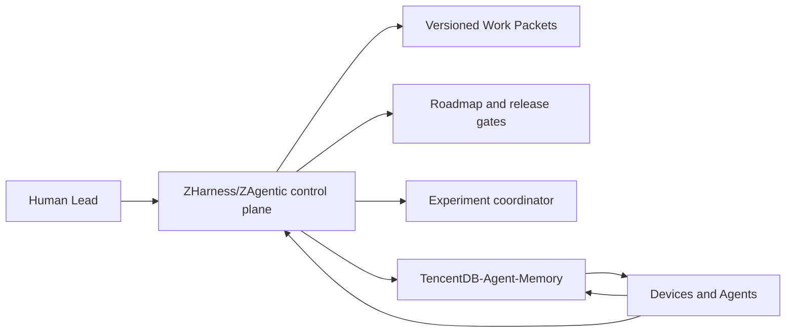
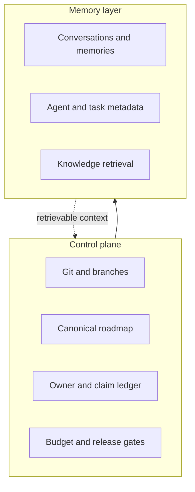

# 调研主题
多设备多 Agent 协同开发的上下文与记忆层选型

对于 Human-led federation 场景，TencentDB-Agent-Memory 最适合作为共享记忆与协作元数据底座；MyContext 更适合作为个人工作上下文层，MineContext 更适合作为本地优先的个人上下文伙伴。三者都不能单独替代 Git、canonical roadmap、Work Packet、任务 claim、预算协调或发布治理，因此推荐将 TencentDB-Agent-Memory 接入现有 ZHarness/ZAgentic control plane，而不是让记忆系统承担控制面职责。

## 输入材料与观察时间
Evidence ledger: `299299409d8779435aa7c58252af6a203bb44abfe7caed15b4f0c153a8fa4d96`
Observed: 2026-08-19T07:27:07.341Z

## Key-Value 概念索引
- Key: `Human-led federation` — Human Lead 跨设备做方向、边界、预算和发布决策；设备与 Agent 是隔离执行单元。
- Key: `Memory layer` — 保存可检索的对话、事实、persona、技能和上下文，不等于任务控制面。
- Key: `Collaboration control plane` — 保存 Work Packet、owner、依赖、状态、claim、审计、版本、预算和发布门。
- Key: `Shared context` — 跨设备和 Agent 可按权限检索、带来源和版本的工作事实。
- Key: `Recommendation` — TencentDB-Agent-Memory 作为共享 memory/metadata layer，ZHarness/ZAgentic 继续拥有 control plane。

Concepts: [[Human-led federation]], [[Memory layer]], [[Collaboration control plane]], [[Shared context]], [[Recommendation]]

## C4 System Landscape
### 协同全景图

## 候选项目表
| Repository | Stars | Topic match |
|---|---:|---:|
| volcengine/MineContext | 5468 | 0 |
| openTrinity/mycontext | 1549 | 2 |
| TencentCloud/TencentDB-Agent-Memory | 23084 | 7 |

## 深读项目卡片
### volcengine/MineContext
本地优先、主动捕获的个人 context-aware AI partner，包含本地服务/API、上下文捕获与处理、数据库/文件存储和隐私保护入口。它更像个人工作上下文产品，不是跨设备团队协作控制面。

- Claim `mine-personal`
- Claim `mine-local`
- Claim `mine-gap`

### openTrinity/mycontext
个人工作 context layer，提供多来源摄取、增量 ingestion、本地 SQLite vault、知识图谱和持久 FastAPI retrieval；显式 approval 与个人数据控制较强，但定位仍是每个人的私有上下文。

- Claim `my-personal`
- Claim `my-retrieval`
- Claim `my-gap`

### TencentCloud/TencentDB-Agent-Memory
MemoryCore 统一保存多层 memory、知识元数据和 asset metadata，并显式建模 users、teams、Agents、tasks、Skills、memberships 与 ownership，通过 HTTP Gateway、TypeScript/Python SDK 接入应用。最接近跨设备多 Agent 的共享 memory/metadata layer。

- Claim `tdai-ownership`
- Claim `tdai-api`
- Claim `tdai-gap`

## 方案族及适用场景对比
### comparison-context
个人上下文能力：MineContext 偏主动捕获和本地优先；MyContext 偏多源工作知识图谱和个人检索；TencentDB-Agent-Memory 偏多层 memory 与资产元数据服务。

Claims: `mine-personal`, `mine-local`, `my-personal`, `my-retrieval`, `tdai-ownership`, `tdai-api`

### comparison-governance
针对 Human-led federation，TencentDB-Agent-Memory 的 teams/Agents/tasks/memberships/ownership 元数据最接近共享协作事实；但三者都需要外部 control plane 管理代码、决策、claim、预算和发布。

Claims: `mine-gap`, `my-gap`, `tdai-ownership`, `tdai-gap`

### comparison-deployment
MyContext 与 MineContext 的本地/个人取向更适合单人隐私边界；TencentDB-Agent-Memory 的独立 Gateway、容器和 API 更适合集中式共享服务，但会增加部署、权限和迁移治理。

Claims: `mine-local`, `my-personal`, `tdai-api`, `tdai-gap`

## C4 Context/Container 与子主题图
### 记忆层与控制面分工

## 关键技术指标矩阵
| Metric | Definition | Unit | Method | Condition | Expected |
|---|---|---|---|---|---|
| context_recall_latency | 从共享 memory layer 返回满足权限过滤的 context 结果的 p95 延迟 | ms | 按 device、agent、query type 和 cold/warm cache 记录端到端请求时间 | pilot 与 baseline 分开统计；不含模型生成时间 | p95 ≤ 800 ms（需用目标部署实测校准） |
| context_provenance_rate | 被 Agent 采用且可回溯到 source、revision 或 memory record 的 context 条目占比 | % | 抽样审计 Agent 输入中的 context references 与 memory metadata | 按 case、device 和 agent 统计 | ≥ 98% |
| cross_device_freshness_lag | 事实在 canonical source 更新后可被另一设备检索到的时间差 p95 | s | 写入带 revision/timestamp 的 probe，测量异设备可见时间 | 网络正常与断网恢复分 cohort | 正常网络 p95 ≤ 60 s；恢复后无静默丢失 |
| ownership_resolution_rate | 每个 shared context、task 或 memory 是否能解析到 user/team/agent/owner/access policy 的比例 | % | 对 metadata graph 做完整性查询并将缺失关系计为失败 | 每次发布前和 nightly audit | 100% |
| control_plane_bypass_rate | 绕过 Work Packet、roadmap gate、claim 或 budget gate 直接产生协作事实的运行占比 | % | 对 control-plane audit log 与 memory API 写入做关联审计 | 所有生产 Agent run | 0% |
| memory_write_conflict_rate | 并发写入同一 logical memory/task 导致冲突、覆盖或人工裁决的比例 | % | 以 logical key、revision 和 writer identity 统计冲突事件 | 多设备并发 pilot 与 baseline | < 1%；所有冲突可恢复且可审计 |

## 建议、限制与待验证事项
### recommendation-primary
选择 TencentDB-Agent-Memory 作为共享 memory/metadata layer，并通过明确 adapter 接入 ZHarness/ZAgentic control plane；不要让它替代 Git、canonical roadmap、Work Packet、planned-cell claim、预算协调或发布门。

Comparisons: `comparison-context`, `comparison-governance`, `comparison-deployment`

### recommendation-secondary
如果第一阶段优先解决个人设备上的私有上下文捕获和检索，选择 MyContext；MineContext 作为本地优先个人 context companion 评估，不作为多人协作底座。

Comparisons: `comparison-context`, `comparison-deployment`

## 来源清单
- [volcengine/MineContext@171c7a9ea8091e326ddcf0f10718aa1b58c83c65:README.md](https://github.com/volcengine/MineContext/blob/171c7a9ea8091e326ddcf0f10718aa1b58c83c65/README.md) — Evidence `80fab05c83d9214a24f7b9a8`
- [volcengine/MineContext@171c7a9ea8091e326ddcf0f10718aa1b58c83c65:README.md](https://github.com/volcengine/MineContext/blob/171c7a9ea8091e326ddcf0f10718aa1b58c83c65/README.md) — Evidence `c1670d9d33d1395b02484b66`
- [volcengine/MineContext@171c7a9ea8091e326ddcf0f10718aa1b58c83c65:README.md](https://github.com/volcengine/MineContext/blob/171c7a9ea8091e326ddcf0f10718aa1b58c83c65/README.md) — Evidence `4f94f3db9db3b45787bf3254`
- [volcengine/MineContext@171c7a9ea8091e326ddcf0f10718aa1b58c83c65:README.md](https://github.com/volcengine/MineContext/blob/171c7a9ea8091e326ddcf0f10718aa1b58c83c65/README.md) — Evidence `46a23e06545555264946319f`
- [volcengine/MineContext@171c7a9ea8091e326ddcf0f10718aa1b58c83c65:README.md](https://github.com/volcengine/MineContext/blob/171c7a9ea8091e326ddcf0f10718aa1b58c83c65/README.md) — Evidence `f5afc3d0b3536e1f3f9ad043`
- [volcengine/MineContext@171c7a9ea8091e326ddcf0f10718aa1b58c83c65:README.md](https://github.com/volcengine/MineContext/blob/171c7a9ea8091e326ddcf0f10718aa1b58c83c65/README.md) — Evidence `9c9efea4647f3d4a7d5a98ff`
- [openTrinity/mycontext@81b3c7ac178dbf141ca97cbe6b6682f73e3d3199:README.md](https://github.com/openTrinity/mycontext/blob/81b3c7ac178dbf141ca97cbe6b6682f73e3d3199/README.md) — Evidence `b694a2b9b94a8ba7e6b47ef4`
- [openTrinity/mycontext@81b3c7ac178dbf141ca97cbe6b6682f73e3d3199:README.md](https://github.com/openTrinity/mycontext/blob/81b3c7ac178dbf141ca97cbe6b6682f73e3d3199/README.md) — Evidence `6953f661bac7a6ee6f695ab3`
- [openTrinity/mycontext@81b3c7ac178dbf141ca97cbe6b6682f73e3d3199:README.md](https://github.com/openTrinity/mycontext/blob/81b3c7ac178dbf141ca97cbe6b6682f73e3d3199/README.md) — Evidence `5d344f534037a88a2d0ae65d`
- [openTrinity/mycontext@81b3c7ac178dbf141ca97cbe6b6682f73e3d3199:README.md](https://github.com/openTrinity/mycontext/blob/81b3c7ac178dbf141ca97cbe6b6682f73e3d3199/README.md) — Evidence `e1c77df9c8b21389e3d252f5`
- [openTrinity/mycontext@81b3c7ac178dbf141ca97cbe6b6682f73e3d3199:README.md](https://github.com/openTrinity/mycontext/blob/81b3c7ac178dbf141ca97cbe6b6682f73e3d3199/README.md) — Evidence `30a9305d1b3b325d52977197`
- [openTrinity/mycontext@81b3c7ac178dbf141ca97cbe6b6682f73e3d3199:docs/design/persona-distill-forge.md](https://github.com/openTrinity/mycontext/blob/81b3c7ac178dbf141ca97cbe6b6682f73e3d3199/docs/design/persona-distill-forge.md) — Evidence `78ba4d9be35e0241eb5f86a4`
- [TencentCloud/TencentDB-Agent-Memory@97f94654280b2932c35ba4806a491999ed244cc9:MemoryCore/Dockerfile](https://github.com/TencentCloud/TencentDB-Agent-Memory/blob/97f94654280b2932c35ba4806a491999ed244cc9/MemoryCore/Dockerfile) — Evidence `1879da8cdc20aaea25ede65c`
- [TencentCloud/TencentDB-Agent-Memory@97f94654280b2932c35ba4806a491999ed244cc9:MemoryCore/Dockerfile](https://github.com/TencentCloud/TencentDB-Agent-Memory/blob/97f94654280b2932c35ba4806a491999ed244cc9/MemoryCore/Dockerfile) — Evidence `6de50efd7dd6779d955d942a`
- [TencentCloud/TencentDB-Agent-Memory@97f94654280b2932c35ba4806a491999ed244cc9:MemoryCore/README.md](https://github.com/TencentCloud/TencentDB-Agent-Memory/blob/97f94654280b2932c35ba4806a491999ed244cc9/MemoryCore/README.md) — Evidence `a53eaf05e9e36a79f063b7ea`
- [TencentCloud/TencentDB-Agent-Memory@97f94654280b2932c35ba4806a491999ed244cc9:MemoryCore/README.md](https://github.com/TencentCloud/TencentDB-Agent-Memory/blob/97f94654280b2932c35ba4806a491999ed244cc9/MemoryCore/README.md) — Evidence `21caa43672cc9f52c6c746a1`
- [TencentCloud/TencentDB-Agent-Memory@97f94654280b2932c35ba4806a491999ed244cc9:MemoryCore/README.md](https://github.com/TencentCloud/TencentDB-Agent-Memory/blob/97f94654280b2932c35ba4806a491999ed244cc9/MemoryCore/README.md) — Evidence `b7389632d90d5c3be6a231f3`
- [TencentCloud/TencentDB-Agent-Memory@97f94654280b2932c35ba4806a491999ed244cc9:MemoryCore/openclaw-plugin/docs/architecture.md](https://github.com/TencentCloud/TencentDB-Agent-Memory/blob/97f94654280b2932c35ba4806a491999ed244cc9/MemoryCore/openclaw-plugin/docs/architecture.md) — Evidence `78fca1c46d4af06c8365d667`
