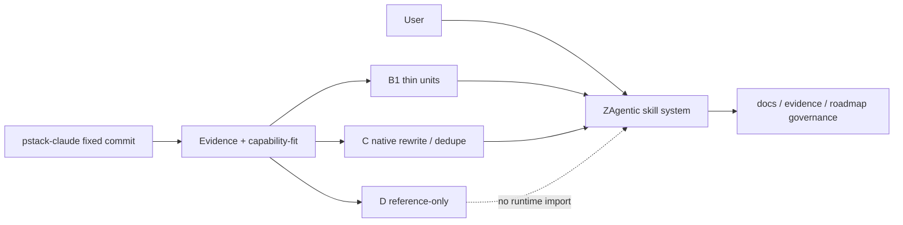
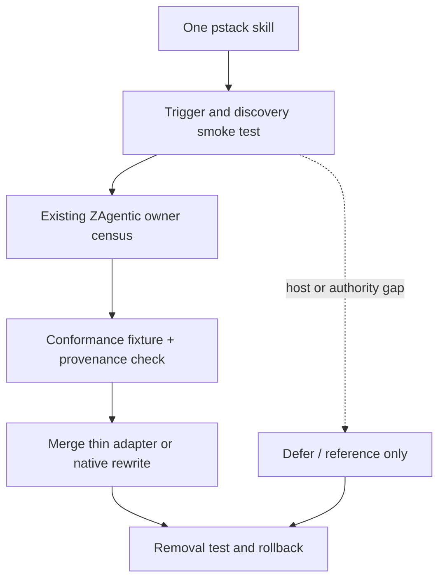

# 调研主题
pstack-claude：可复利 skill 组合与逐 skill 合并拟合

在固定 commit 3b0bc62e13f507c426997ba472e3430dd3e4ef05（v0.9.75）的证据范围内，pstack-claude 的可复利价值主要来自调查、设计、并行候选、对抗评审、验证和原则技能的组合协议；整套插件 runtime、poteto-mode 全局路由、模型 sheet、transcript 读取和 PR shipping glue 不适合直接进入 ZAgentic。逐个 58 个 skill 的 capability-fit 将 29 个标为 B1 薄适配、20 个标为 C 原生去重或高 owner 成本、9 个标为 D 宿主/政策关键缺口；没有 skill 达到 A。

## 输入材料与观察时间
Evidence ledger: `a1aa83d3252b3ab4117de871d4f1648a98f16616bfb8ddb7cea842489a1dd580`
Observed: 2026-10-08T07:18:39.944Z

## Key-Value 概念索引
- Key: `user-job` — 让用户快速组装一套科学、可复核、可复利的工具组合和能力组合。
- Key: `unit-capability` — 把 pstack 仓库拆成可独立验收的 skill 与 principle 单元，而不是整体引入 plugin runtime。
- Key: `native-owner` — ZAgentic 继续拥有 skill discovery、evidence、roadmap、docs governance、Git safety 和 Human authority。
- Key: `fit-model` — 每个单元使用 R×O 的 coverage、semantic match、composability、ownership cost 和 adaptation scope 判定 A/B1/B2/B3/C/D。
- Key: `lifecycle-stage` — 当前是 problem-discovery；报告输出选择边界与验证入口，不把静态研究写成完成的生产合并。
- Key: `provenance` — pstack、Cursor team kit、端口新增内容和 babysit 的来源必须分别保留 NOTICE、版权与许可证边界。

Concepts: [[user-job]], [[unit-capability]], [[native-owner]], [[fit-model]], [[lifecycle-stage]], [[provenance]]

## C4 System Landscape
### pstack-claude 与 ZAgentic 的组合边界

## 候选项目表
| Repository | Stars | Topic match |
|---|---:|---:|
| michael-denyer/pstack-claude | 1607 | 21 |

## 深读项目卡片
### michael-denyer/pstack-claude / 58 skill units
The repository is a multi-runtime port of an opinionated skill stack. Its instruction-level methods are separable, but the automatic router, agents, model sheet, hooks, transcript paths, Pi extension and PR shipping scripts form a separate runtime ownership surface. The per-skill fit artifact keeps those surfaces distinct.

- Claim `methodology`
- Claim `usage`
- Claim `skill-inventory`
- Claim `runtime-coupling`
- Claim `provenance`
- Claim `fit-verdict`

## 方案族及适用场景对比
### whole-vs-unit
Constraint: preserve one ZAgentic authority and composable skills. Option: import the whole plugin. Evidence: the fixed repository couples skills with routing, mappings, hooks, agents and scripts. Tradeoff: whole import creates a second runtime and policy surface. Decision: choose unit-level selective absorption.

Claims: `methodology`, `runtime-coupling`, `fit-verdict`

### instruction-vs-runtime
Constraint: skills must run under ZAgentic discovery and governance. Option: copy Markdown plus resources. Evidence: many skills are instruction-level but references and scripts call Claude/Pi/Copilot tools. Tradeoff: a thin adapter preserves method while runtime glue multiplies owners. Decision: B1 only for bounded units; defer runtime glue.

Claims: `usage`, `runtime-coupling`, `b1-scope`, `d-scope`

### native-vs-duplicate
Constraint: avoid duplicate owners. Option: copy methods that overlap ZAgentic code research, domain modeling, TDD, roadmap and teaching. Evidence: the 58-skill matrix marks those units C. Tradeoff: native rewrite costs more up front but keeps one authority. Decision: use C for semantic delta and owner-preserving rewrite.

Claims: `c-scope`, `fit-verdict`

### provenance-and-license
Constraint: every absorbed unit must remain legally and operationally traceable. Evidence: MIT license, mixed Cursor/team-kit sources, NOTICE and forks records. Tradeoff: copied prose without provenance is cheaper immediately but creates attribution and upgrade risk. Decision: preserve notices and pin source commit per unit.

Claims: `provenance`, `usage`

### validation-and-exit
Constraint: a skill must be removable and its value observable. Evidence: pstack emphasizes verification and decision trails, while the run did not live-test multi-runtime behavior. Tradeoff: static similarity is cheaper than a smoke test but cannot prove trigger or authority fit. Decision: require trigger smoke, representative workflow, provenance check and removal test.

Claims: `methodology`, `evidence-boundary`, `b1-scope`

## C4 Context/Container 与子主题图
### 逐 skill 落地与退出路径

## 关键技术指标矩阵
| Metric | Definition | Unit | Method | Condition | Expected |
|---|---|---|---|---|---|
| skill-discovery-pass-rate | 候选 skill 在 ZAgentic 中可被发现并按预期触发的比例 | percentage | 在干净 fixture 中执行命令名、自然语言触发和冲突触发各一次 | 触发错误或路由到重复 owner 计失败 | 100% for every merged unit |
| representative-workflow-pass-rate | B1/C 单元完成一个最小代表性任务并产出约定 evidence 的比例 | percentage | 按每个 skill 的 primary-findings 输入/输出契约执行一条 fixture | 输出缺 source/provenance/verification 记录计失败 | 100% before landing |
| removal-pass-rate | 移除候选单元后 ZAgentic native 路径保持健康的比例 | percentage | 删除适配目录或规则后运行原有 discovery、docs、roadmap 和相关 checks | 任何 native authority 断裂计 hard stop | 100% |
| provenance-coverage | 吸收内容具有固定 commit、LICENSE/NOTICE 和上游来源记录的比例 | percentage | 逐文件检查 provenance ledger 与 README/docs 登记 | 缺任一必需来源字段计失败 | 100% |
| authority-bypass-count | 外部 skill 绕过 Human/Git/docs/evidence authority 的次数 | count | 运行不可逆操作、外部写入、重复完成、伪 evidence 和路由越权负例 | 任何一次 bypass 都停止该候选 | 0 |
| owner-duplication-count | 同一触发语义下仍存在多个未声明 owner 的 skill 数量 | count | 比较 skill descriptions、docs map 和实际 trigger smoke 输出 | 重复 owner 未形成显式 delegation 或 native replacement 计失败 | 0 |
| runtime-adaptation-surface | 候选需要翻译的宿主工具、路径、模型、并发和状态契约数量 | contract count | 记录 adapter 触碰的工具类别和状态字段 | 触碰 router/authority/full workflow platform 则转 D | B1 remains a removable thin layer |
| unknown-closure | 未运行的多宿主和外部写操作假设被 PoC 或明确 decision closure 的比例 | percentage | 逐项运行 local smoke 或记录延期理由/退出路径 | 不得把未观察到改写成 absent | 100% before runtime adoption |

## 建议、限制与待验证事项
### overall-choice
选择按 skill 单元选择性吸收；不把 pstack-claude 整体插件、poteto-mode router 或 runtime glue 作为 ZAgentic 的平台依赖。保留 ZAgentic 的 native discovery、evidence、roadmap、docs governance、Git safety 和 Human authority。

Comparisons: `whole-vs-unit`, `instruction-vs-runtime`

### phase-b1
第一阶段处理 29 个 B1 单元：benchmark-checklist、blast-radius、bro、correct、create-verification-skill、deslop、fix-ci、get-pr-comments、make-pr-easy-to-review、show-me-your-work、technical-writing、thermo-nuclear-code-quality-review、unslop、what-did-i-get-done，以及判定为 B1 的 principle skills。先做 trigger/discovery smoke、代表性工作流、NOTICE/provenance 和 removal test。

Comparisons: `instruction-vs-runtime`, `validation-and-exit`

### phase-c
第二阶段处理 20 个 C 单元：先做与现有 ZAgentic owner 的语义 delta，再选择吸收原则、改写为本地 skill，或明确保留现有 native owner；不做无差别复制。

Comparisons: `native-vs-duplicate`, `validation-and-exit`

### defer-d
暂缓 9 个 D 单元：arena、babysit、poteto-help、poteto-mode、principle-never-block-on-the-human、recall、reflect、setup-pstack、swarm。除非另有技术决策证明 host-neutral adapter、authority mapping、审批和退出路径，否则只保留研究引用。

Comparisons: `whole-vs-unit`, `instruction-vs-runtime`

### preserve-provenance
任何吸收都必须携带固定 commit、MIT/LICENSE、NOTICE.md、LICENSE-cursor-team-kit 和必要的 forks/provenance 说明；把上游内容、ZAgentic 改写和本地规则分开记录。

Comparisons: `provenance-and-license`

### validation-gate
每个 B1/C 候选的 landing gate 是：能被本仓库发现；触发器不与现有 skill 冲突；一次代表性工作流通过；关键输出进入本地 evidence/roadmap/docs 约定；删除候选后 native 路径仍通过；任何 authority bypass 或不可逆写操作直接停止。

Comparisons: `validation-and-exit`, `native-vs-duplicate`

### remaining-risks
剩余风险是静态研究没有证明多宿主运行时等价、PR/merge 脚本可能产生外部写操作、全局 router 可能改变触发优先级，以及 58 个单元的上游更新会带来 provenance 和语义漂移；这些风险由下一阶段 PoC 和重新评估触发条件承担。

Comparisons: `instruction-vs-runtime`, `provenance-and-license`, `validation-and-exit`

## 来源清单
- [michael-denyer/pstack-claude@3b0bc62e13f507c426997ba472e3430dd3e4ef05:plugins/pstack/README.md](https://github.com/michael-denyer/pstack-claude/blob/3b0bc62e13f507c426997ba472e3430dd3e4ef05/plugins/pstack/README.md) — Evidence `12d421b734013cfe899bc2e3`
- [michael-denyer/pstack-claude@3b0bc62e13f507c426997ba472e3430dd3e4ef05:plugins/pstack/README.md](https://github.com/michael-denyer/pstack-claude/blob/3b0bc62e13f507c426997ba472e3430dd3e4ef05/plugins/pstack/README.md) — Evidence `007c3eb74de995b9649a2005`
- [michael-denyer/pstack-claude@3b0bc62e13f507c426997ba472e3430dd3e4ef05:plugins/pstack/README.md](https://github.com/michael-denyer/pstack-claude/blob/3b0bc62e13f507c426997ba472e3430dd3e4ef05/plugins/pstack/README.md) — Evidence `fdedbb5d8c958b3edd398d7d`
- [michael-denyer/pstack-claude@3b0bc62e13f507c426997ba472e3430dd3e4ef05:plugins/pstack/README.md](https://github.com/michael-denyer/pstack-claude/blob/3b0bc62e13f507c426997ba472e3430dd3e4ef05/plugins/pstack/README.md) — Evidence `4797770cef7b7db9309ed284`
- [michael-denyer/pstack-claude@3b0bc62e13f507c426997ba472e3430dd3e4ef05:README.md](https://github.com/michael-denyer/pstack-claude/blob/3b0bc62e13f507c426997ba472e3430dd3e4ef05/README.md) — Evidence `00bb4a6fe38a1df48cc8936d`
