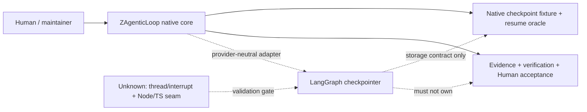
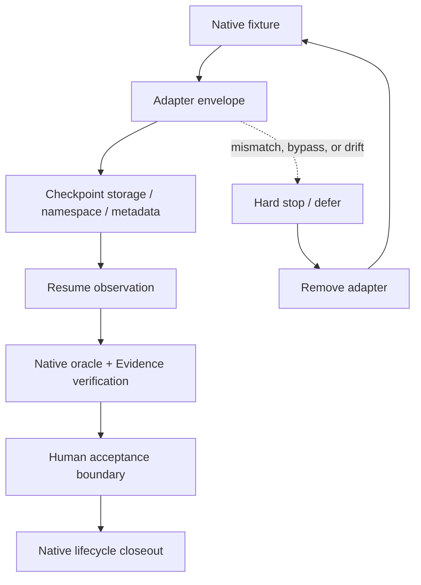

# 调研主题
LangGraph checkpoint/resume adapter probe for ZAgenticLoop

The second authenticated fresh research pass supports LangGraph's checkpointer storage contract as a narrow, testable capability, but does not establish complete interrupt/resume identity semantics, a native TypeScript/Node.js seam, or authority over ZAgenticLoop execution. Keep the native core and run one removable adapter probe against the native checkpoint fixture; any authority bypass, identity drift, digest drift, or failed removal is a hard stop.

## 输入材料与观察时间
Evidence ledger: `c012ac5ea04d673fb1e7c7f6f317c62dc822d34727f78ef39889c61f5d544250`
Observed: 2026-08-23T17:15:41.823Z

## Key-Value 概念索引
- Key: `native-checkpoint-oracle` — ZAgenticLoop 的 native checkpoint fixture 与 resume oracle 是 conformance 事实源，固定 execution identity、checkpoint metadata、state digest、duplicate、Evidence、verification、Human acceptance 与 authority。
- Key: `checkpointer-storage-contract` — LangGraph 的 BaseCheckpointSaver conformance surface 关注 blob round-trip、metadata preservation、namespace isolation、incremental updates 等存储语义。
- Key: `provider-neutral-adapter` — 外部 checkpointer 只通过 envelope 进入 native core，不能创建第二 execution authority 或改写 native lifecycle facts。
- Key: `evidence-gap` — 编译器 mechanical match 不等于语义闭合；thread/interrupt resume identity、Node/TS seam、security/approval ownership 仍需单独验证。
- Key: `experience-version` — 当前只验证一个可丢弃的 durable-state/checkpoint vertical slice，不承担 whole-framework adoption 或 production runtime commitment。

Concepts: [[native-checkpoint-oracle]], [[checkpointer-storage-contract]], [[provider-neutral-adapter]], [[evidence-gap]], [[experience-version]]

## C4 System Landscape
### A34 checkpoint adapter decision landscape

## 候选项目表
| Repository | Stars | Topic match |
|---|---:|---:|
| langchain-ai/langgraph | 40282 | 4 |

## 深读项目卡片
### langchain-ai/langgraph / checkpointer storage capability
Fresh evidence supports a separately testable BaseCheckpointSaver storage contract and a Postgres persistence implementation for durable workflows. The evidence is sufficient for a bounded storage adapter probe, not for whole-framework or native Node.js adoption.

- Claim `checkpoint-contract`
- Claim `durable-storage`
- Claim `runtime-gap`
- Claim `resume-gap`

## 方案族及适用场景对比
### native-vs-storage-adapter
The native fixture defines the complete semantic oracle, while LangGraph evidence defines a narrower storage contract. The adapter is acceptable only when the external checkpoint maps back to the native execution identity, metadata, digest, and duplicate rules.

Claims: `checkpoint-contract`, `native-oracle`, `conformance-isolation`

### durability-vs-resume-semantics
Durable Postgres-backed storage is useful evidence for persistence, but durable storage is not the same as proven interrupt/resume identity, duplicate delivery, or recovery semantics. The latter must be tested in the probe.

Claims: `durable-storage`, `resume-gap`

### host-runtime-fit
The Python/PyPI/Psycopg boundary may require a process or service adapter in a TypeScript/Node.js host. Until the runtime seam and ownership are measured, this is an unverified integration cost rather than a reason to adopt the framework core.

Claims: `runtime-gap`, `conformance-isolation`

### authority-and-exit
Keeping execution, Evidence, verification, Human acceptance, security, and lifecycle native makes the external capability removable. Any adapter path that duplicates those facts creates a second authority and must stop.

Claims: `native-oracle`, `authority-boundary`, `runtime-gap`

## C4 Context/Container 与子主题图
### Probe flow and removal boundary

## 关键技术指标矩阵
| Metric | Definition | Unit | Method | Condition | Expected |
|---|---|---|---|---|---|
| checkpoint-conformance-pass-rate | Native fixture scenarios that the external checkpoint adapter reproduces without semantic drift | critical scenario pass rate | Run write/read, metadata, namespace, incremental update, resume, duplicate, retry, and digest cases against native and adapter paths | Any identity, authority, digest, or acceptance bypass is a hard failure | 100% of critical scenarios |
| resume-identity-preservation | Resumed work items that retain the native execution id, task id, attempt, agent id, checkpoint id, and state digest | percentage | Inject restart, interrupt, retry, and duplicate delivery, then compare the resume observation with the native oracle | No second execution authority may be created | 100% |
| namespace-isolation | Checkpoint reads that cannot cross the native task/network/namespace boundary | negative-case pass rate | Attempt cross-task, cross-network, stale-revision, and wrong-agent reads | Every unauthorized read is rejected and auditable | 100% rejection of invalid scope |
| evidence-digest-integrity | Resumed Evidence and verification bindings that retain the expected digest and execution identity | percentage | Tamper with checkpoint state, artifact refs, Evidence digests, verification digests, and review handoff refs | Any drift blocks the oracle and prevents side effects | 100% detection; 0 silent drift |
| runtime-ownership-boundedness | New runtime, process, package, upgrade, credential, and incident responsibilities introduced by the adapter | owned obligations and components | Inventory Python/Psycopg or Node bridge processes, version-skew cases, deploy/rollback steps, and owners | Unowned or unbounded obligations block continuation | One removable adapter with explicit owner and rollback |
| unknown-closure | Unverified resume, interrupt, Node/TS, security, and approval criteria closed by primary evidence or reproducible probe results | criteria closure rate | Track each criterion from the A34 evidence gap list to a pinned source or test artifact | Unknown is not rewritten as absent; no framework-core decision before closure | 100% before any durable dependency decision |
| native-removal-pass-rate | Native fixture and resume oracle scenarios that still pass after deleting the external adapter | scenario pass rate | Remove adapter package/process/config and rerun the native build and conformance suite | Native semantic owner must not require the external framework | 100% native path remains runnable |

## 建议、限制与待验证事项
### keep-native-core
Keep ZAgenticLoop's native Graph/OPN core and do not adopt LangGraph as the execution or lifecycle authority. Use LangGraph only as a candidate checkpointer capability behind a provider-neutral adapter.

Comparisons: `native-vs-storage-adapter`, `authority-and-exit`

### define-envelope
Define the adapter envelope around source execution/task/attempt, source revision, checkpoint namespace and id, artifact reference, state digest, and native execution identity. Reject any checkpoint that cannot reconstruct or verify those bindings.

Comparisons: `native-vs-storage-adapter`

### run-resume-probe
Run one isolated experience-version probe covering checkpoint write/read, namespace, metadata, process restart, interrupt/resume, duplicate delivery, retry, and state digest. The current thread/interrupt behavior is unverified and must be closed with primary evidence or runtime tests before a continue decision.

Comparisons: `durability-vs-resume-semantics`

### gate-runtime
Treat Node/TypeScript integration, Python/Psycopg process ownership, version skew, credentials, sandbox, and rollback as explicit validation gates. Do not add a runtime dependency until the adapter owner and failure recovery are bounded.

Comparisons: `host-runtime-fit`

### hard-stop-authority
Hard-stop on authority bypass, changed execution identity, second execution authority, Evidence or verification digest drift, Human acceptance bypass, side effects before acceptance, or any native-oracle failure.

Comparisons: `authority-and-exit`, `native-vs-storage-adapter`

### remove-and-close
After the probe, remove the adapter and rerun the native fixture. Continue only if the native path remains unchanged and all critical scenarios pass; otherwise defer or stop. The unverified Node/TS seam and resume semantics must remain visible in the closeout.

Comparisons: `authority-and-exit`, `durability-vs-resume-semantics`

## 来源清单
- [langchain-ai/langgraph@f09cfe8ffc1eeffd68f4b628ed69c30f7cad229f:libs/checkpoint-conformance/README.md](https://github.com/langchain-ai/langgraph/blob/f09cfe8ffc1eeffd68f4b628ed69c30f7cad229f/libs/checkpoint-conformance/README.md) — Evidence `062b826405b696d0a9fa4f64`
- [langchain-ai/langgraph@f09cfe8ffc1eeffd68f4b628ed69c30f7cad229f:libs/checkpoint-conformance/README.md](https://github.com/langchain-ai/langgraph/blob/f09cfe8ffc1eeffd68f4b628ed69c30f7cad229f/libs/checkpoint-conformance/README.md) — Evidence `6ee57429e8b6891fcd4fd1c6`
- [langchain-ai/langgraph@f09cfe8ffc1eeffd68f4b628ed69c30f7cad229f:libs/checkpoint-conformance/README.md](https://github.com/langchain-ai/langgraph/blob/f09cfe8ffc1eeffd68f4b628ed69c30f7cad229f/libs/checkpoint-conformance/README.md) — Evidence `e0458f396bb78f8b06a9f3fd`
- [langchain-ai/langgraph@f09cfe8ffc1eeffd68f4b628ed69c30f7cad229f:libs/checkpoint-conformance/README.md](https://github.com/langchain-ai/langgraph/blob/f09cfe8ffc1eeffd68f4b628ed69c30f7cad229f/libs/checkpoint-conformance/README.md) — Evidence `28fbdbbeb69b0dd1ca4882e2`
- [langchain-ai/langgraph@f09cfe8ffc1eeffd68f4b628ed69c30f7cad229f:libs/checkpoint-postgres/README.md](https://github.com/langchain-ai/langgraph/blob/f09cfe8ffc1eeffd68f4b628ed69c30f7cad229f/libs/checkpoint-postgres/README.md) — Evidence `7146173f86f924c4895d1114`
