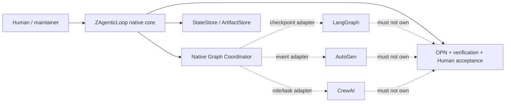
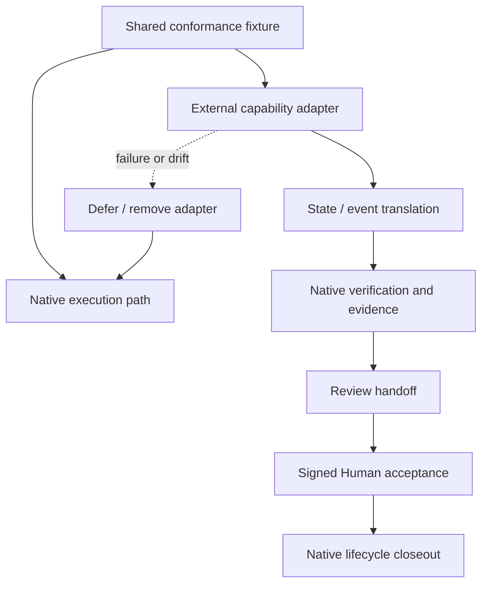

# 调研主题
ZAgenticLoop Graph Coordinator：fresh ledger 下的原生核心与外部能力边界

A31 的 fresh sealed ledger 支持对 LangGraph、AutoGen、CrewAI 做证据有界的能力比较，但不支持让任何外部框架接管 ZAgenticLoop 的 Graph/OPN authority、Human acceptance、security policy 或 lifecycle facts。LangGraph 最适合先做 checkpoint contract 探针，AutoGen 可做 event/delegation 探针，CrewAI 可做 role/task 与 persistence 探针；推荐保持 native core，并把所有外部能力限制在可移除 adapter 与统一 conformance fixture 后。LangGraph 的 observability 与 AutoGen 的 security/sandbox 仍是显式 unknown，不是 absent。

## 输入材料与观察时间
Evidence ledger: `5fbef253ed7642b64eeb69af673a2e458fa2ed04b9aaabfde8fb09c6f2128a36`
Observed: 2026-08-23T15:31:57.837Z

## Key-Value 概念索引
- Key: `native-semantic-owner` — Graph execution、OPN evidence、Human acceptance、security policy 与 lifecycle facts 继续由 ZAgenticLoop 原生核心拥有。
- Key: `unit-capability` — 外部项目只以可移除、可 conformance 的窄能力进入，例如 checkpoint、event delegation、role/task orchestration 或 persistence。
- Key: `provider-neutral-seam` — Provider、framework 与 process runtime 通过 adapter 接入，不改变 OPN、verification 和 Human authority 的产品语义。
- Key: `authority-boundary` — 外部框架不能成为 Human acceptance、artifact provenance、sandbox policy 或最终 lifecycle status 的事实源。
- Key: `evidence-strength` — Stars 与 topicMatch 只描述候选背景；固定 commit 的 canonical source、运行行为和 conformance 才决定可采用性。
- Key: `lifecycle-stage` — 当前仍是 problem-discovery；只承诺可丢弃的 capability probe，不提前承担生产级平台迁移。
- Key: `exitability` — 适配器必须可删除，且删除后不需要重写 native OPN、evidence、Human acceptance 或 lifecycle facts。

Concepts: [[native-semantic-owner]], [[unit-capability]], [[provider-neutral-seam]], [[authority-boundary]], [[evidence-strength]], [[lifecycle-stage]], [[exitability]]

## C4 System Landscape
### Fresh-ledger Graph Coordinator 决策景观

## 候选项目表
| Repository | Stars | Topic match |
|---|---:|---:|
| langchain-ai/langgraph | 40278 | 7 |
| microsoft/autogen | 60586 | 5 |
| crewAIInc/crewAI | 57501 | 5 |

## 深读项目卡片
### langchain-ai/langgraph / checkpoint contract
Fresh evidence supports a stateful multi-actor framework and checkpointer/conformance surface; use it first as a durable-state probe, not as the product authority.

- Claim `langgraph-fit`
- Claim `langgraph-boundary`

### microsoft/autogen / event delegation
Fresh evidence supports publish-subscribe agents and CloudEvents-shaped integration seams; delegation and security ownership still require a bounded probe.

- Claim `autogen-fit`
- Claim `autogen-boundary`

### crewAIInc/crewAI / role-task persistence
Fresh evidence supports a Python agent framework with Flow persistence, agent-to-agent utilities, traces, and deployment surfaces; runtime and exit costs must be measured before adoption.

- Claim `crewai-fit`
- Claim `crewai-boundary`

## 方案族及适用场景对比
### capability-families
约束是保持 native authority，同时寻找窄能力：LangGraph 偏 checkpoint/state contract，AutoGen 偏 event/delegation，CrewAI 偏 role/task、Flow persistence 和 runtime surface；它们不能被压成一个总 feature ranking。

Claims: `langgraph-fit`, `autogen-fit`, `crewai-fit`

### native-vs-framework-core
如果外部框架接管 Graph/OPN、Human acceptance 或 lifecycle facts，就会引入第二 authority、状态翻译和退出责任；因此 native core 优先，外部能力只通过 adapter 进入。

Claims: `langgraph-boundary`, `autogen-boundary`, `crewai-boundary`, `native-boundary`

### unit-capability-composition
推荐按 bounded slice 顺序验证 LangGraph checkpoint、AutoGen event/delegation、CrewAI role/task/persistence，并对三者使用同一 conformance fixture 和 native verification path。

Claims: `langgraph-fit`, `autogen-fit`, `crewai-fit`, `native-boundary`

### runtime-and-exit
CrewAI 的 Python/runtime/deployment surface 以及所有候选的 state/event translation 都必须由 adapter owner 承担；任何复制 native lifecycle 或形成双事实源的方案应 defer。

Claims: `crewai-boundary`, `langgraph-boundary`, `autogen-boundary`

### evidence-gaps
A31 ledger 明确保留 LangGraph observability 和 AutoGen security/sandbox 两个 unknownCriteria；未知不是 absent，报告必须把它们变成下一轮验证入口。

Claims: `fresh-evidence-boundary`, `autogen-boundary`

## C4 Context/Container 与子主题图
### Adapter 能力组合与退出边界

## 关键技术指标矩阵
| Metric | Definition | Unit | Method | Condition | Expected |
|---|---|---|---|---|---|
| conformance-pass-rate | native 与 adapter 对同一 graph fixture 的语义一致通过率 | scenario pass rate | 运行 duplicate、retry、approval、resume、verification、handoff、acceptance、rollback 八类场景 | 任一越权、错误完成或 digest 漂移为硬失败 | 100% critical scenarios pass |
| checkpoint-recovery | checkpoint-backed execution 在重启或重复投递后恢复同一 native work item 的成功率 | percentage | 注入 process crash、network timeout、duplicate delivery 后重放 LangGraph probe | 不得创建第二个有效 execution authority | 100% |
| authority-preservation | 外部 adapter 无法绕过 native approval、artifact、verification、Human acceptance 与 lifecycle gate 的比例 | negative-case pass rate | 运行 bypass attempts 并检查 native event/evidence records | 任何 bypass 为 hard stop | 100% |
| unknown-closure | 本轮 unknownCriteria 被下一轮可复核证据或明确决策覆盖的比例 | criteria closure rate | 针对 LangGraph observability 与 AutoGen security/sandbox 逐项运行 primary-source 或 runtime validation | 未知不得被默认改写为 absent | 100% before framework-core decision |
| adapter-removability | 移除外部 adapter 后 native fixture 的可运行程度 | fixture pass rate | 编译并运行不含外部框架的 native path，检查 OPN/evidence/lifecycle records | 不得重写 native semantic owner | 100% native path remains |
| state-translation-cost | 外部状态与 native work item/OPN facts 之间新增的映射复杂度 | fields + translation modules | 统计字段、转换函数、持久化投影和回滚分支 | 复制核心 lifecycle 或引入双写事实源即 reject | one narrow adapter and no second source of truth |
| runtime-ownership-cost | 引入候选所增加的运行组件、升级面、版本错配和 incident owner 数量 | components + owner-hours per quarter | 记录 runtime、package、deployment、upgrade、rollback 与 support obligations | 必须有明确 owner 和 exit test | no unbounded platform obligation |

## 建议、限制与待验证事项
### overall-choice
推荐保持 ZAgenticLoop native core，不把 LangGraph、AutoGen 或 CrewAI 作为 Graph Coordinator 核心依赖；外部项目只进入 adapter-only capability path。

Comparisons: `native-vs-framework-core`, `runtime-and-exit`

### langgraph-probe
第一阶段只做 LangGraph checkpoint/resume 探针：将外部 checkpoint 映射到 native work item，验证 namespace、metadata、duplicate、resume、evidence digest 和 Human acceptance；LangGraph observability 仍是 unknown follow-up。

Comparisons: `unit-capability-composition`, `evidence-gaps`

### autogen-probe
第二阶段再做 AutoGen event/delegation 探针，只有在 event identity、task digest、artifact refs、retry、review handoff 和 security/sandbox ownership 都能映射时继续；本轮 security criterion 未验证。

Comparisons: `unit-capability-composition`, `evidence-gaps`

### crewai-probe
第三阶段才评估 CrewAI role/task 与 Flow persistence，并量化 Python runtime、状态翻译、部署、升级和退出成本；任一项超过窄 adapter 责任即 defer。

Comparisons: `unit-capability-composition`, `runtime-and-exit`

### conformance-gate
三类 adapter 使用同一 fixture 验证 duplicate delivery、blocked approval、resume、evidence digest、独立 verification、review handoff、Human acceptance、uncertain outcome 和 rollback；任何 authority bypass 都是 hard stop。

Comparisons: `native-vs-framework-core`, `unit-capability-composition`

### fresh-ledger-boundary
本报告只使用 A31 fresh sealed ledger；不要把 A29 的旧 ledger、旧 fingerprint 或旧的 unknownCriteria 结果混入本结论。下一轮先补 LangGraph observability 与 AutoGen security/sandbox，再决定是否扩大候选范围。

Comparisons: `evidence-gaps`, `runtime-and-exit`

### ownership-and-exit
adapter owner 必须承担状态/事件翻译、security review、version skew、monitoring、rollback 和 removal test；任何需要复制 native lifecycle 的方案停止。

Comparisons: `native-vs-framework-core`, `runtime-and-exit`

- Unknown: langchain-ai/langgraph / observability-and-evidence
- Unknown: microsoft/autogen / security-and-sandbox

## 来源清单
- [langchain-ai/langgraph@f09cfe8ffc1eeffd68f4b628ed69c30f7cad229f:AGENTS.md](https://github.com/langchain-ai/langgraph/blob/f09cfe8ffc1eeffd68f4b628ed69c30f7cad229f/AGENTS.md) — Evidence `f1bc2d9c9130f8447fb238e9`
- [langchain-ai/langgraph@f09cfe8ffc1eeffd68f4b628ed69c30f7cad229f:AGENTS.md](https://github.com/langchain-ai/langgraph/blob/f09cfe8ffc1eeffd68f4b628ed69c30f7cad229f/AGENTS.md) — Evidence `8e073a335f0750bc2dbd531b`
- [langchain-ai/langgraph@f09cfe8ffc1eeffd68f4b628ed69c30f7cad229f:AGENTS.md](https://github.com/langchain-ai/langgraph/blob/f09cfe8ffc1eeffd68f4b628ed69c30f7cad229f/AGENTS.md) — Evidence `3413fe7a228f104ee3b5cd48`
- [langchain-ai/langgraph@f09cfe8ffc1eeffd68f4b628ed69c30f7cad229f:AGENTS.md](https://github.com/langchain-ai/langgraph/blob/f09cfe8ffc1eeffd68f4b628ed69c30f7cad229f/AGENTS.md) — Evidence `55c81fdf1c5a1ef4023733f5`
- [langchain-ai/langgraph@f09cfe8ffc1eeffd68f4b628ed69c30f7cad229f:libs/checkpoint-conformance/README.md](https://github.com/langchain-ai/langgraph/blob/f09cfe8ffc1eeffd68f4b628ed69c30f7cad229f/libs/checkpoint-conformance/README.md) — Evidence `21832892a3528adc38c5308a`
- [langchain-ai/langgraph@f09cfe8ffc1eeffd68f4b628ed69c30f7cad229f:libs/checkpoint-conformance/pyproject.toml](https://github.com/langchain-ai/langgraph/blob/f09cfe8ffc1eeffd68f4b628ed69c30f7cad229f/libs/checkpoint-conformance/pyproject.toml) — Evidence `5be631748c8ef33befd5449a`
- [langchain-ai/langgraph@f09cfe8ffc1eeffd68f4b628ed69c30f7cad229f:libs/checkpoint/README.md](https://github.com/langchain-ai/langgraph/blob/f09cfe8ffc1eeffd68f4b628ed69c30f7cad229f/libs/checkpoint/README.md) — Evidence `6de10e656c7486e3dc89360b`
- [microsoft/autogen@027ecf0a379bcc1d09956d46d12d44a3ad9cee14:docs/design/01 - Programming Model.md](https://github.com/microsoft/autogen/blob/027ecf0a379bcc1d09956d46d12d44a3ad9cee14/docs/design/01%20-%20Programming%20Model.md) — Evidence `bb338b2ff54633163d90270f`
- [microsoft/autogen@027ecf0a379bcc1d09956d46d12d44a3ad9cee14:docs/design/01 - Programming Model.md](https://github.com/microsoft/autogen/blob/027ecf0a379bcc1d09956d46d12d44a3ad9cee14/docs/design/01%20-%20Programming%20Model.md) — Evidence `de2f99b90318169b8422ece3`
- [microsoft/autogen@027ecf0a379bcc1d09956d46d12d44a3ad9cee14:docs/design/01 - Programming Model.md](https://github.com/microsoft/autogen/blob/027ecf0a379bcc1d09956d46d12d44a3ad9cee14/docs/design/01%20-%20Programming%20Model.md) — Evidence `9ddbf455a5b5504746148383`
- [microsoft/autogen@027ecf0a379bcc1d09956d46d12d44a3ad9cee14:docs/design/01 - Programming Model.md](https://github.com/microsoft/autogen/blob/027ecf0a379bcc1d09956d46d12d44a3ad9cee14/docs/design/01%20-%20Programming%20Model.md) — Evidence `d4f1c1cc3d0b2eef33f3ccce`
- [microsoft/autogen@027ecf0a379bcc1d09956d46d12d44a3ad9cee14:docs/design/01 - Programming Model.md](https://github.com/microsoft/autogen/blob/027ecf0a379bcc1d09956d46d12d44a3ad9cee14/docs/design/01%20-%20Programming%20Model.md) — Evidence `ec9d3122cad155222d2da212`
- [microsoft/autogen@027ecf0a379bcc1d09956d46d12d44a3ad9cee14:docs/design/01 - Programming Model.md](https://github.com/microsoft/autogen/blob/027ecf0a379bcc1d09956d46d12d44a3ad9cee14/docs/design/01%20-%20Programming%20Model.md) — Evidence `43887dbed78548311b8f7c6c`
- [microsoft/autogen@027ecf0a379bcc1d09956d46d12d44a3ad9cee14:docs/design/04 - Agent and Topic ID Specs.md](https://github.com/microsoft/autogen/blob/027ecf0a379bcc1d09956d46d12d44a3ad9cee14/docs/design/04%20-%20Agent%20and%20Topic%20ID%20Specs.md) — Evidence `a8a2a771ddd575f1299ad1f8`
- [crewAIInc/crewAI@f4731f5025f861c78e3af0487cc80bf5e7c64782:AGENTS.md](https://github.com/crewAIInc/crewAI/blob/f4731f5025f861c78e3af0487cc80bf5e7c64782/AGENTS.md) — Evidence `0d7f5966db7f79bf2e643875`
- [crewAIInc/crewAI@f4731f5025f861c78e3af0487cc80bf5e7c64782:AGENTS.md](https://github.com/crewAIInc/crewAI/blob/f4731f5025f861c78e3af0487cc80bf5e7c64782/AGENTS.md) — Evidence `f426d046e3922a50834972a8`
- [crewAIInc/crewAI@f4731f5025f861c78e3af0487cc80bf5e7c64782:AGENTS.md](https://github.com/crewAIInc/crewAI/blob/f4731f5025f861c78e3af0487cc80bf5e7c64782/AGENTS.md) — Evidence `2dbcab5a9de9f338dc9d3ad9`
- [crewAIInc/crewAI@f4731f5025f861c78e3af0487cc80bf5e7c64782:AGENTS.md](https://github.com/crewAIInc/crewAI/blob/f4731f5025f861c78e3af0487cc80bf5e7c64782/AGENTS.md) — Evidence `035e52e8f7a93c7431b329ee`
- [crewAIInc/crewAI@f4731f5025f861c78e3af0487cc80bf5e7c64782:lib/cli/src/crewai_cli/templates/AGENTS.md](https://github.com/crewAIInc/crewAI/blob/f4731f5025f861c78e3af0487cc80bf5e7c64782/lib/cli/src/crewai_cli/templates/AGENTS.md) — Evidence `129e20600265c5f6f592e157`
- [crewAIInc/crewAI@f4731f5025f861c78e3af0487cc80bf5e7c64782:lib/cli/src/crewai_cli/templates/AGENTS.md](https://github.com/crewAIInc/crewAI/blob/f4731f5025f861c78e3af0487cc80bf5e7c64782/lib/cli/src/crewai_cli/templates/AGENTS.md) — Evidence `b75a38f9696b9a83ee568ec3`
- [crewAIInc/crewAI@f4731f5025f861c78e3af0487cc80bf5e7c64782:lib/cli/src/crewai_cli/templates/AGENTS.md](https://github.com/crewAIInc/crewAI/blob/f4731f5025f861c78e3af0487cc80bf5e7c64782/lib/cli/src/crewai_cli/templates/AGENTS.md) — Evidence `5dd3fa2a1ade52faa375bf72`
- [crewAIInc/crewAI@f4731f5025f861c78e3af0487cc80bf5e7c64782:lib/crewai-tools/src/crewai_tools/aws/bedrock/agents/README.md](https://github.com/crewAIInc/crewAI/blob/f4731f5025f861c78e3af0487cc80bf5e7c64782/lib/crewai-tools/src/crewai_tools/aws/bedrock/agents/README.md) — Evidence `9bfb8106dd3081234d3acd3e`
