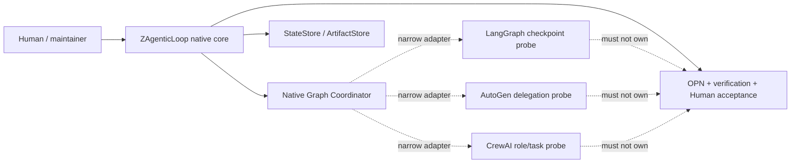
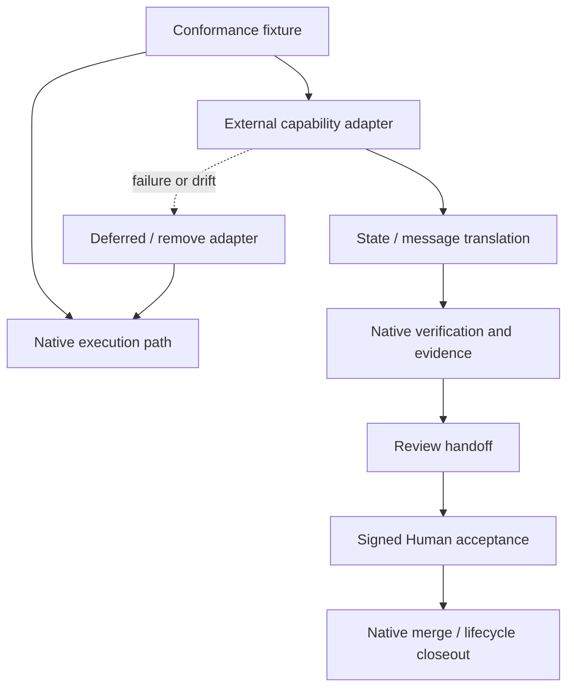

# 调研主题
ZAgenticLoop Graph Coordinator：外部框架核心依赖还是原生核心 + Adapter

当前不建议把 LangGraph、AutoGen 或 CrewAI 作为 ZAgenticLoop Graph Coordinator 的核心依赖。Architecture Study 显示，原生 TypeScript 核心已经拥有执行身份、OPN tracer、StateStore/ArtifactStore、独立验证、Human acceptance、权限与生命周期闸门；外部框架若整体接管，会引入状态翻译、权威边界和升级退出责任。推荐保持 native core，优先以 LangGraph 做 durable-state/checkpoint 单能力探针，再按同一 conformance fixture 评估 AutoGen 的 delegation 与 CrewAI 的 role/task orchestration。候选 sealed evidence 主要来自维护文档，不能替代运行验证；研究采集受未认证 GitHub API 限流影响，未知项保留为 unverified。

## 输入材料与观察时间
Evidence ledger: `027cac7d47443e5461caa53696a5c89e954ff40e2cb33dc9929249f426138fd3`
Observed: 2026-08-20T09:35:56.531Z

## Key-Value 概念索引
- Key: `native-semantic-owner` — Graph execution、OPN evidence、Human acceptance、security gate 与 lifecycle fact 继续由 ZAgenticLoop 原生核心拥有。
- Key: `unit-capability` — 外部项目只以可移除、可 conformance 的窄能力进入，例如 checkpoint、delegation 或 role/task orchestration。
- Key: `provider-neutral-seam` — Provider、framework 与 process runtime 都通过 adapter 接入，不改变 OPN、verification 和 Human authority 的产品语义。
- Key: `authority-boundary` — 任何外部框架都不能成为 Human acceptance、artifact provenance、sandbox policy 或最终 lifecycle status 的事实源。
- Key: `evidence-strength` — Stars 与 topicMatch 只描述背景；固定 commit 的 canonical source、运行行为和 conformance 才决定可采用性。
- Key: `lifecycle-stage` — 当前是 problem-discovery；只承诺一个可丢弃的 capability probe，不提前承担生产级平台迁移。
- Key: `exitability` — 适配器必须可删除，且删除后不需要重写 native OPN、evidence、Human acceptance 或 lifecycle facts。

Concepts: [[native-semantic-owner]], [[unit-capability]], [[provider-neutral-seam]], [[authority-boundary]], [[evidence-strength]], [[lifecycle-stage]], [[exitability]]

## C4 System Landscape
### Graph Coordinator 决策景观

## 候选项目表
| Repository | Stars | Topic match |
|---|---:|---:|
| yc-software/qm | 13978 | 3 |
| OpenHands/OpenHands | 84552 | 3 |
| aaif-goose/goose | 53038 | 4 |
| anomalyco/opencode | 199377 | 2 |
| Aider-AI/aider | 48340 | 1 |
| Significant-Gravitas/AutoGPT | 186693 | 6 |
| langchain-ai/langgraph | 40082 | 1 |
| crewAIInc/crewAI | 57365 | 3 |
| letta-ai/letta | 24310 | 2 |
| microsoft/autogen | 60535 | 2 |
| agentscope-ai/agentscope | 29092 | 5 |
| pydantic/pydantic-ai | 19409 | 4 |
| microsoft/TaskWeaver | 6174 | 3 |

## 深读项目卡片
### yc-software/qm / benchmark
本决策的产品语义参照，不是 Graph Coordinator 候选；直接证据不足以证明完整产品闭环。

- Claim `qm-boundary`

### OpenHands / product surface
更接近 coding-agent 产品面，超出本次 Graph Coordinator 单能力范围；当前证据不足以纳入核心候选。

- Claim `openhands-boundary`

### aaif-goose/goose / execution harness
执行与 MCP 扩展方向值得另行研究，但不是本次 Graph Coordinator 核心候选。

- Claim `goose-boundary`

### anomalyco/opencode / coding harness
本轮证据主要是低强度维护材料，不能作为 Graph Coordinator 选择依据。

- Claim `low-evidence`

### Aider-AI/aider / coding UX
适合作为低摩擦 coding UX 参照，不覆盖当前 Graph/OPN ownership decision。

- Claim `aider-boundary`

### Significant-Gravitas/AutoGPT / platform
主题相关但本轮证据不足，暂不纳入本次严肃比较。

- Claim `low-evidence`

### langchain-ai/langgraph / durable state
最值得做 checkpoint/resume 单能力探针；不应接管 OPN、Human acceptance 或 lifecycle。

- Claim `langgraph-fit`
- Claim `native-boundary`

### crewAIInc/crewAI / role orchestration
可作为 role/task orchestration 探针，但 Python runtime、状态翻译和退出成本必须先量化。

- Claim `crewai-fit`
- Claim `native-boundary`

### letta-ai/letta / memory direction
当前 main 的实现边界不适合作为本次 Graph Coordinator 依赖候选。

- Claim `letta-boundary`

### microsoft/autogen / delegation
可作为 delegation/多 Agent 协调探针，但当前证据不支持核心依赖或直接嵌入。

- Claim `autogen-fit`
- Claim `native-boundary`

### agentscope-ai/agentscope / framework
本轮没有足够运行证据，保持 fog/unverified。

- Claim `low-evidence`

### pydantic/pydantic-ai / typed framework
本轮没有足够运行证据，保持 fog/unverified。

- Claim `low-evidence`

### microsoft/TaskWeaver / specialist workflow
适合作为专业任务状态/插件能力参照，不是当前 Graph Coordinator 候选。

- Claim `taskweaver-boundary`

## 方案族及适用场景对比
### role-families
OpenHands/Goose/Aider 是产品或执行 harness，LangGraph/AutoGen/CrewAI 是状态与编排底座，qm/TaskWeaver/Letta 属于不同能力族；将它们混成一个总榜会掩盖语义与 ownership 差异。

Claims: `qm-boundary`, `openhands-boundary`, `goose-boundary`, `langgraph-fit`, `autogen-fit`, `crewai-fit`, `taskweaver-boundary`

### native-vs-framework-core
约束是保留 OPN、verification、Human acceptance、sandbox 与 lifecycle authority；native core 满足现有边界，framework-core 会引入重复状态机、状态翻译和升级退出责任，因此选择 native core。

Claims: `native-boundary`, `langgraph-fit`, `autogen-fit`, `crewai-fit`

### unit-capability-composition
LangGraph 先探 checkpoint/resume，AutoGen 再探 delegation，CrewAI 再探 role/task orchestration；三者都只能通过同一个 provider-neutral adapter 和 native conformance fixture 进入。

Claims: `langgraph-fit`, `autogen-fit`, `crewai-fit`, `native-boundary`

### evidence-and-ownership
三个 serious candidates 都有固定 commit，但现有 evidence 主要来自维护材料；因此 evidence strength 与 product fit 不能等同，外部限流导致的未重新采集项必须保持 unverified。

Claims: `langgraph-fit`, `autogen-fit`, `crewai-fit`, `low-evidence`

### paths-to-avoid
避免按 Stars/topicMatch 直接选择框架、避免让外部框架成为 Human acceptance 或最终 lifecycle authority、避免在没有可移除边界前引入 Python runtime 或整个平台。

Claims: `low-evidence`, `native-boundary`, `crewai-fit`, `autogen-fit`

## C4 Context/Container 与子主题图
### Adapter 能力组合与退出边界

## 关键技术指标矩阵
| Metric | Definition | Unit | Method | Condition | Expected |
|---|---|---|---|---|---|
| conformance-pass-rate | native 与 adapter 对同一 graph fixture 的语义一致通过率 | scenario pass rate | 运行 duplicate、retry、approval、resume、verification、handoff、acceptance、rollback 八类场景 | 任一越权、错误完成或 digest 漂移为硬失败 | 100% critical scenarios pass |
| recovery-success | 重启或外部调用不确定后恢复同一 work item 的成功率 | percentage | 注入 process crash、network timeout、duplicate delivery 后重放 fixture | 不得创建第二个有效 execution authority | 100% |
| authority-preservation | 外部 adapter 无法绕过 native approval、artifact、verification、Human acceptance 与 lifecycle gate 的比例 | negative-case pass rate | 运行 bypass attempts 并检查 native event/evidence records | 任何 bypass 为 hard stop | 100% |
| adapter-removability | 移除外部 adapter 后 native fixture 的可运行程度 | fixture pass rate | 编译并运行不含外部框架的 native path，检查 OPN/evidence/lifecycle records | 不得重写 native semantic owner | 100% native path remains |
| state-translation-cost | 外部状态与 native work item/OPN facts 之间新增的映射复杂度 | fields + translation modules | 统计字段、转换函数、持久化投影和回滚分支 | 复制核心 lifecycle 或引入双写事实源即 reject | one narrow adapter and no second source of truth |
| runtime-ownership-cost | 引入候选所增加的运行组件、升级面、版本错配和 incident owner 数量 | components + owner-hours per quarter | 记录 runtime、package、deployment、upgrade、rollback 与 support obligations | 必须有明确 owner 和 exit test | no unbounded platform obligation |
| evidence-strength | 候选对关键 capability 的 canonical source、运行验证和 conformance 证据强度 | 0-4 ordinal | source quality + behavior proof + pinned revision + operator evidence | 维护文档 alone 不得判 native/product fit | at least 3/4 before adoption |

## 建议、限制与待验证事项
### overall-choice
推荐保持 ZAgenticLoop native core，不把 LangGraph、AutoGen 或 CrewAI 作为 Graph Coordinator 核心依赖；外部项目只进入 adapter-only capability path。code-study evidence 见 `study-bec314dee3c9f2e9f604c52b`。

Comparisons: `native-vs-framework-core`, `evidence-and-ownership`

### langgraph-probe
第一阶段只做 LangGraph checkpoint/resume 探针：外部状态映射到 native work item，保留 native OPN/evidence/Human acceptance/lifecycle；失败时删除 adapter。

Comparisons: `unit-capability-composition`, `native-vs-framework-core`

### autogen-probe
第二阶段再做 AutoGen delegation 探针，只有在身份、task digest、artifact refs、retry 与 review handoff 能映射且不改变 authority boundary 时继续。

Comparisons: `unit-capability-composition`, `evidence-and-ownership`

### crewai-probe
第三阶段才评估 CrewAI role/task orchestration，并单独量化 Python runtime、状态翻译、部署、升级和退出成本；任一项超过窄 adapter 责任即 defer。

Comparisons: `unit-capability-composition`, `paths-to-avoid`

### conformance-gate
使用同一 fixture 做 native vs adapter conformance：重复投递、blocked approval、resume、evidence digest、独立 verification、review handoff、Human acceptance、uncertain outcome 和 rollback 均必须可观察。

Comparisons: `unit-capability-composition`, `native-vs-framework-core`

### evidence-follow-up
补采前不把当前 ledger 的 unknownCriteria=[] 解读为能力闭环；受 GitHub API 限流影响的当前 brief 需在额度恢复或提供 token 后重新采集并重新固定 ledger。

Comparisons: `evidence-and-ownership`

### ownership-and-exit
adapter owner 必须同时承担状态翻译、security review、version skew、monitoring、rollback 和 removal test；任何需要复制 native lifecycle 的方案停止。

Comparisons: `native-vs-framework-core`, `paths-to-avoid`

## 来源清单
- [yc-software/qm@568252bd4e6da5288b239573abef972f3e16b3f9:AGENTS.md](https://github.com/yc-software/qm/blob/568252bd4e6da5288b239573abef972f3e16b3f9/AGENTS.md) — Evidence `fda2e563d1e368c2bd37224d`
- [yc-software/qm@568252bd4e6da5288b239573abef972f3e16b3f9:AGENTS.md](https://github.com/yc-software/qm/blob/568252bd4e6da5288b239573abef972f3e16b3f9/AGENTS.md) — Evidence `e17665fcb2d429a8094b819a`
- [yc-software/qm@568252bd4e6da5288b239573abef972f3e16b3f9:AGENTS.md](https://github.com/yc-software/qm/blob/568252bd4e6da5288b239573abef972f3e16b3f9/AGENTS.md) — Evidence `b0167b8a495789769c514513`
- [yc-software/qm@568252bd4e6da5288b239573abef972f3e16b3f9:AGENTS.md](https://github.com/yc-software/qm/blob/568252bd4e6da5288b239573abef972f3e16b3f9/AGENTS.md) — Evidence `a784b8ef0fa65d574d45a180`
- [yc-software/qm@568252bd4e6da5288b239573abef972f3e16b3f9:AGENTS.md](https://github.com/yc-software/qm/blob/568252bd4e6da5288b239573abef972f3e16b3f9/AGENTS.md) — Evidence `5b5605c6f66e29b9730e0fd7`
- [yc-software/qm@568252bd4e6da5288b239573abef972f3e16b3f9:AGENTS.md](https://github.com/yc-software/qm/blob/568252bd4e6da5288b239573abef972f3e16b3f9/AGENTS.md) — Evidence `05b8496b76d09bcd89daac9b`
- [yc-software/qm@568252bd4e6da5288b239573abef972f3e16b3f9:AGENTS.md](https://github.com/yc-software/qm/blob/568252bd4e6da5288b239573abef972f3e16b3f9/AGENTS.md) — Evidence `abc6323c1409ada7810b2173`
- [yc-software/qm@568252bd4e6da5288b239573abef972f3e16b3f9:AGENTS.md](https://github.com/yc-software/qm/blob/568252bd4e6da5288b239573abef972f3e16b3f9/AGENTS.md) — Evidence `921684cc00ec378acbe4f1dd`
- [yc-software/qm@568252bd4e6da5288b239573abef972f3e16b3f9:AGENTS.md](https://github.com/yc-software/qm/blob/568252bd4e6da5288b239573abef972f3e16b3f9/AGENTS.md) — Evidence `aefaec0374f72b9e81ade71b`
- [OpenHands/OpenHands@7a9aacb7b69eef80c15f49230e27bbd2b3c6f41a:AGENTS.md](https://github.com/OpenHands/OpenHands/blob/7a9aacb7b69eef80c15f49230e27bbd2b3c6f41a/AGENTS.md) — Evidence `2b92eeca52b2e775b2a34780`
- [OpenHands/OpenHands@7a9aacb7b69eef80c15f49230e27bbd2b3c6f41a:AGENTS.md](https://github.com/OpenHands/OpenHands/blob/7a9aacb7b69eef80c15f49230e27bbd2b3c6f41a/AGENTS.md) — Evidence `43e8740529cabcdd135c9d4f`
- [OpenHands/OpenHands@7a9aacb7b69eef80c15f49230e27bbd2b3c6f41a:AGENTS.md](https://github.com/OpenHands/OpenHands/blob/7a9aacb7b69eef80c15f49230e27bbd2b3c6f41a/AGENTS.md) — Evidence `e1aa7e102504a35400d8cb47`
- [OpenHands/OpenHands@7a9aacb7b69eef80c15f49230e27bbd2b3c6f41a:AGENTS.md](https://github.com/OpenHands/OpenHands/blob/7a9aacb7b69eef80c15f49230e27bbd2b3c6f41a/AGENTS.md) — Evidence `dd5ccafc0649546e3dcac4c9`
- [OpenHands/OpenHands@7a9aacb7b69eef80c15f49230e27bbd2b3c6f41a:AGENTS.md](https://github.com/OpenHands/OpenHands/blob/7a9aacb7b69eef80c15f49230e27bbd2b3c6f41a/AGENTS.md) — Evidence `35ffdb85c7fd2a2f4f9dcb4b`
- [OpenHands/OpenHands@7a9aacb7b69eef80c15f49230e27bbd2b3c6f41a:AGENTS.md](https://github.com/OpenHands/OpenHands/blob/7a9aacb7b69eef80c15f49230e27bbd2b3c6f41a/AGENTS.md) — Evidence `d2c97e98509c1edaac30c7bc`
- [OpenHands/OpenHands@7a9aacb7b69eef80c15f49230e27bbd2b3c6f41a:AGENTS.md](https://github.com/OpenHands/OpenHands/blob/7a9aacb7b69eef80c15f49230e27bbd2b3c6f41a/AGENTS.md) — Evidence `e1ae258557be109606e90199`
- [OpenHands/OpenHands@7a9aacb7b69eef80c15f49230e27bbd2b3c6f41a:AGENTS.md](https://github.com/OpenHands/OpenHands/blob/7a9aacb7b69eef80c15f49230e27bbd2b3c6f41a/AGENTS.md) — Evidence `9a393669a76cf0f43d94ed6e`
- [OpenHands/OpenHands@7a9aacb7b69eef80c15f49230e27bbd2b3c6f41a:AGENTS.md](https://github.com/OpenHands/OpenHands/blob/7a9aacb7b69eef80c15f49230e27bbd2b3c6f41a/AGENTS.md) — Evidence `74f9c13b327b70362191487e`
- [aaif-goose/goose@cd23a1ed409eed6405da0b521af42186eaa32336:.devcontainer/Dockerfile](https://github.com/aaif-goose/goose/blob/cd23a1ed409eed6405da0b521af42186eaa32336/.devcontainer/Dockerfile) — Evidence `6a00c995a3a95425022cf6b5`
- [aaif-goose/goose@cd23a1ed409eed6405da0b521af42186eaa32336:.devcontainer/Dockerfile](https://github.com/aaif-goose/goose/blob/cd23a1ed409eed6405da0b521af42186eaa32336/.devcontainer/Dockerfile) — Evidence `c03f47ffca21e4aa5e7eded4`
- [aaif-goose/goose@cd23a1ed409eed6405da0b521af42186eaa32336:.devcontainer/Dockerfile](https://github.com/aaif-goose/goose/blob/cd23a1ed409eed6405da0b521af42186eaa32336/.devcontainer/Dockerfile) — Evidence `3d8c78c54e5844d30270d48d`
- [aaif-goose/goose@cd23a1ed409eed6405da0b521af42186eaa32336:.devcontainer/Dockerfile](https://github.com/aaif-goose/goose/blob/cd23a1ed409eed6405da0b521af42186eaa32336/.devcontainer/Dockerfile) — Evidence `ea2783fcb9fa4c8f5d185038`
- [aaif-goose/goose@cd23a1ed409eed6405da0b521af42186eaa32336:AGENTS.md](https://github.com/aaif-goose/goose/blob/cd23a1ed409eed6405da0b521af42186eaa32336/AGENTS.md) — Evidence `ccca347bb938f98a1abd5fe3`
- [aaif-goose/goose@cd23a1ed409eed6405da0b521af42186eaa32336:AGENTS.md](https://github.com/aaif-goose/goose/blob/cd23a1ed409eed6405da0b521af42186eaa32336/AGENTS.md) — Evidence `cdc726d56dd8a221c5d85f70`
- [aaif-goose/goose@cd23a1ed409eed6405da0b521af42186eaa32336:AGENTS.md](https://github.com/aaif-goose/goose/blob/cd23a1ed409eed6405da0b521af42186eaa32336/AGENTS.md) — Evidence `a99b1a37b1bfc12bc048a132`
- [aaif-goose/goose@cd23a1ed409eed6405da0b521af42186eaa32336:AGENTS.md](https://github.com/aaif-goose/goose/blob/cd23a1ed409eed6405da0b521af42186eaa32336/AGENTS.md) — Evidence `8716319714bda53e7b43ac6c`
- [aaif-goose/goose@cd23a1ed409eed6405da0b521af42186eaa32336:AGENTS.md](https://github.com/aaif-goose/goose/blob/cd23a1ed409eed6405da0b521af42186eaa32336/AGENTS.md) — Evidence `36f268b3e103c3d13a567993`
- [anomalyco/opencode@b155b15694dbcc6768f11d2f25cc2bdd1f738ab4:.opencode/glossary/README.md](https://github.com/anomalyco/opencode/blob/b155b15694dbcc6768f11d2f25cc2bdd1f738ab4/.opencode/glossary/README.md) — Evidence `66a8a418bf2494cea4638124`
- [anomalyco/opencode@b155b15694dbcc6768f11d2f25cc2bdd1f738ab4:.opencode/glossary/README.md](https://github.com/anomalyco/opencode/blob/b155b15694dbcc6768f11d2f25cc2bdd1f738ab4/.opencode/glossary/README.md) — Evidence `8eb8e3ed18312721fb3f2195`
- [anomalyco/opencode@b155b15694dbcc6768f11d2f25cc2bdd1f738ab4:.opencode/glossary/README.md](https://github.com/anomalyco/opencode/blob/b155b15694dbcc6768f11d2f25cc2bdd1f738ab4/.opencode/glossary/README.md) — Evidence `18474f018f20b445a91d19e4`
- [anomalyco/opencode@b155b15694dbcc6768f11d2f25cc2bdd1f738ab4:.opencode/glossary/README.md](https://github.com/anomalyco/opencode/blob/b155b15694dbcc6768f11d2f25cc2bdd1f738ab4/.opencode/glossary/README.md) — Evidence `d83446f052c2c9121a518f71`
- [anomalyco/opencode@b155b15694dbcc6768f11d2f25cc2bdd1f738ab4:.opencode/glossary/README.md](https://github.com/anomalyco/opencode/blob/b155b15694dbcc6768f11d2f25cc2bdd1f738ab4/.opencode/glossary/README.md) — Evidence `4ed95fa8a51022b85680ea17`
- [anomalyco/opencode@b155b15694dbcc6768f11d2f25cc2bdd1f738ab4:.opencode/glossary/README.md](https://github.com/anomalyco/opencode/blob/b155b15694dbcc6768f11d2f25cc2bdd1f738ab4/.opencode/glossary/README.md) — Evidence `43dfa804594d31974d6a14d7`
- [anomalyco/opencode@b155b15694dbcc6768f11d2f25cc2bdd1f738ab4:.opencode/glossary/README.md](https://github.com/anomalyco/opencode/blob/b155b15694dbcc6768f11d2f25cc2bdd1f738ab4/.opencode/glossary/README.md) — Evidence `68017e7f886e70f18c05c19f`
- [anomalyco/opencode@b155b15694dbcc6768f11d2f25cc2bdd1f738ab4:.opencode/glossary/README.md](https://github.com/anomalyco/opencode/blob/b155b15694dbcc6768f11d2f25cc2bdd1f738ab4/.opencode/glossary/README.md) — Evidence `e629c97b69b199f53b6ca88b`
- [anomalyco/opencode@b155b15694dbcc6768f11d2f25cc2bdd1f738ab4:.opencode/glossary/README.md](https://github.com/anomalyco/opencode/blob/b155b15694dbcc6768f11d2f25cc2bdd1f738ab4/.opencode/glossary/README.md) — Evidence `67b176c7f9b76126ff033ac5`
- [Aider-AI/aider@5dc9490bb35f9729ef2c95d00a19ccd30c26339c:README.md](https://github.com/Aider-AI/aider/blob/5dc9490bb35f9729ef2c95d00a19ccd30c26339c/README.md) — Evidence `0da05726323c81b5e77537ce`
- [Aider-AI/aider@5dc9490bb35f9729ef2c95d00a19ccd30c26339c:README.md](https://github.com/Aider-AI/aider/blob/5dc9490bb35f9729ef2c95d00a19ccd30c26339c/README.md) — Evidence `44f094d6daa8f438abb564ea`
- [Aider-AI/aider@5dc9490bb35f9729ef2c95d00a19ccd30c26339c:README.md](https://github.com/Aider-AI/aider/blob/5dc9490bb35f9729ef2c95d00a19ccd30c26339c/README.md) — Evidence `51d51a551d8d0349cee57dcf`
- [Aider-AI/aider@5dc9490bb35f9729ef2c95d00a19ccd30c26339c:README.md](https://github.com/Aider-AI/aider/blob/5dc9490bb35f9729ef2c95d00a19ccd30c26339c/README.md) — Evidence `79b2049aaaad0a9ac2ad99d2`
- [Aider-AI/aider@5dc9490bb35f9729ef2c95d00a19ccd30c26339c:README.md](https://github.com/Aider-AI/aider/blob/5dc9490bb35f9729ef2c95d00a19ccd30c26339c/README.md) — Evidence `0076b819347a7a828a589d10`
- [Aider-AI/aider@5dc9490bb35f9729ef2c95d00a19ccd30c26339c:README.md](https://github.com/Aider-AI/aider/blob/5dc9490bb35f9729ef2c95d00a19ccd30c26339c/README.md) — Evidence `a22e730db049defbfa7389d7`
- [Aider-AI/aider@5dc9490bb35f9729ef2c95d00a19ccd30c26339c:README.md](https://github.com/Aider-AI/aider/blob/5dc9490bb35f9729ef2c95d00a19ccd30c26339c/README.md) — Evidence `a15d4c1344dd0b8512430917`
- [Aider-AI/aider@5dc9490bb35f9729ef2c95d00a19ccd30c26339c:README.md](https://github.com/Aider-AI/aider/blob/5dc9490bb35f9729ef2c95d00a19ccd30c26339c/README.md) — Evidence `e791589b62ae8821fdeea240`
- [Aider-AI/aider@5dc9490bb35f9729ef2c95d00a19ccd30c26339c:README.md](https://github.com/Aider-AI/aider/blob/5dc9490bb35f9729ef2c95d00a19ccd30c26339c/README.md) — Evidence `b35f28f1cc9ad0d5ddd416ce`
- [Significant-Gravitas/AutoGPT@601093ddfe23a3d58a9c8f4a208bd49b203ee612:.claude/skills/vercel-react-best-practices/AGENTS.md](https://github.com/Significant-Gravitas/AutoGPT/blob/601093ddfe23a3d58a9c8f4a208bd49b203ee612/.claude/skills/vercel-react-best-practices/AGENTS.md) — Evidence `0105594b9bd744c71b450a10`
- [Significant-Gravitas/AutoGPT@601093ddfe23a3d58a9c8f4a208bd49b203ee612:.claude/skills/vercel-react-best-practices/AGENTS.md](https://github.com/Significant-Gravitas/AutoGPT/blob/601093ddfe23a3d58a9c8f4a208bd49b203ee612/.claude/skills/vercel-react-best-practices/AGENTS.md) — Evidence `7447e96569ef9ac301c34b2a`
- [Significant-Gravitas/AutoGPT@601093ddfe23a3d58a9c8f4a208bd49b203ee612:.claude/skills/vercel-react-best-practices/AGENTS.md](https://github.com/Significant-Gravitas/AutoGPT/blob/601093ddfe23a3d58a9c8f4a208bd49b203ee612/.claude/skills/vercel-react-best-practices/AGENTS.md) — Evidence `35c311bc1801956153d45e67`
- [Significant-Gravitas/AutoGPT@601093ddfe23a3d58a9c8f4a208bd49b203ee612:.claude/skills/vercel-react-best-practices/AGENTS.md](https://github.com/Significant-Gravitas/AutoGPT/blob/601093ddfe23a3d58a9c8f4a208bd49b203ee612/.claude/skills/vercel-react-best-practices/AGENTS.md) — Evidence `db1693087e20941e610d53b4`
- [Significant-Gravitas/AutoGPT@601093ddfe23a3d58a9c8f4a208bd49b203ee612:.claude/skills/vercel-react-best-practices/AGENTS.md](https://github.com/Significant-Gravitas/AutoGPT/blob/601093ddfe23a3d58a9c8f4a208bd49b203ee612/.claude/skills/vercel-react-best-practices/AGENTS.md) — Evidence `236feb182bca3e2aaeaf29aa`
- [Significant-Gravitas/AutoGPT@601093ddfe23a3d58a9c8f4a208bd49b203ee612:.claude/skills/vercel-react-best-practices/AGENTS.md](https://github.com/Significant-Gravitas/AutoGPT/blob/601093ddfe23a3d58a9c8f4a208bd49b203ee612/.claude/skills/vercel-react-best-practices/AGENTS.md) — Evidence `16e27d8d0eaeddb7c06c3901`
- [Significant-Gravitas/AutoGPT@601093ddfe23a3d58a9c8f4a208bd49b203ee612:.claude/skills/vercel-react-best-practices/AGENTS.md](https://github.com/Significant-Gravitas/AutoGPT/blob/601093ddfe23a3d58a9c8f4a208bd49b203ee612/.claude/skills/vercel-react-best-practices/AGENTS.md) — Evidence `f2b14f16e946e869c73f3d6f`
- [Significant-Gravitas/AutoGPT@601093ddfe23a3d58a9c8f4a208bd49b203ee612:.claude/skills/vercel-react-best-practices/AGENTS.md](https://github.com/Significant-Gravitas/AutoGPT/blob/601093ddfe23a3d58a9c8f4a208bd49b203ee612/.claude/skills/vercel-react-best-practices/AGENTS.md) — Evidence `e6cba238617aaa8e7000d51c`
- [Significant-Gravitas/AutoGPT@601093ddfe23a3d58a9c8f4a208bd49b203ee612:.claude/skills/vercel-react-best-practices/AGENTS.md](https://github.com/Significant-Gravitas/AutoGPT/blob/601093ddfe23a3d58a9c8f4a208bd49b203ee612/.claude/skills/vercel-react-best-practices/AGENTS.md) — Evidence `2df073da6312ac4696b15b69`
- [langchain-ai/langgraph@f09cfe8ffc1eeffd68f4b628ed69c30f7cad229f:AGENTS.md](https://github.com/langchain-ai/langgraph/blob/f09cfe8ffc1eeffd68f4b628ed69c30f7cad229f/AGENTS.md) — Evidence `1266c49589267df774dee5e9`
- [langchain-ai/langgraph@f09cfe8ffc1eeffd68f4b628ed69c30f7cad229f:AGENTS.md](https://github.com/langchain-ai/langgraph/blob/f09cfe8ffc1eeffd68f4b628ed69c30f7cad229f/AGENTS.md) — Evidence `61d9bd40020edae8d891a9a0`
- [langchain-ai/langgraph@f09cfe8ffc1eeffd68f4b628ed69c30f7cad229f:AGENTS.md](https://github.com/langchain-ai/langgraph/blob/f09cfe8ffc1eeffd68f4b628ed69c30f7cad229f/AGENTS.md) — Evidence `a97b98b1f8491fb18806826f`
- [langchain-ai/langgraph@f09cfe8ffc1eeffd68f4b628ed69c30f7cad229f:AGENTS.md](https://github.com/langchain-ai/langgraph/blob/f09cfe8ffc1eeffd68f4b628ed69c30f7cad229f/AGENTS.md) — Evidence `995977232918e95bc4f7968d`
- [langchain-ai/langgraph@f09cfe8ffc1eeffd68f4b628ed69c30f7cad229f:AGENTS.md](https://github.com/langchain-ai/langgraph/blob/f09cfe8ffc1eeffd68f4b628ed69c30f7cad229f/AGENTS.md) — Evidence `0583f30e11cd3e9e7eb2d1ad`
- [langchain-ai/langgraph@f09cfe8ffc1eeffd68f4b628ed69c30f7cad229f:AGENTS.md](https://github.com/langchain-ai/langgraph/blob/f09cfe8ffc1eeffd68f4b628ed69c30f7cad229f/AGENTS.md) — Evidence `06bfa6645b43d686af376096`
- [langchain-ai/langgraph@f09cfe8ffc1eeffd68f4b628ed69c30f7cad229f:AGENTS.md](https://github.com/langchain-ai/langgraph/blob/f09cfe8ffc1eeffd68f4b628ed69c30f7cad229f/AGENTS.md) — Evidence `bc964b8b7a425b0856ceaa62`
- [langchain-ai/langgraph@f09cfe8ffc1eeffd68f4b628ed69c30f7cad229f:AGENTS.md](https://github.com/langchain-ai/langgraph/blob/f09cfe8ffc1eeffd68f4b628ed69c30f7cad229f/AGENTS.md) — Evidence `b0d8c30c76244540d9c60d81`
- [langchain-ai/langgraph@f09cfe8ffc1eeffd68f4b628ed69c30f7cad229f:AGENTS.md](https://github.com/langchain-ai/langgraph/blob/f09cfe8ffc1eeffd68f4b628ed69c30f7cad229f/AGENTS.md) — Evidence `09c0abfe50c9608bad5ef4b6`
- [crewAIInc/crewAI@0c2bcb510c8b15d077e45e34513cc3631cb366c1:AGENTS.md](https://github.com/crewAIInc/crewAI/blob/0c2bcb510c8b15d077e45e34513cc3631cb366c1/AGENTS.md) — Evidence `b5d54cbfdc50b01b54c3fd64`
- [crewAIInc/crewAI@0c2bcb510c8b15d077e45e34513cc3631cb366c1:AGENTS.md](https://github.com/crewAIInc/crewAI/blob/0c2bcb510c8b15d077e45e34513cc3631cb366c1/AGENTS.md) — Evidence `71333c76e7055360b395d506`
- [crewAIInc/crewAI@0c2bcb510c8b15d077e45e34513cc3631cb366c1:AGENTS.md](https://github.com/crewAIInc/crewAI/blob/0c2bcb510c8b15d077e45e34513cc3631cb366c1/AGENTS.md) — Evidence `0f04b7a5abc8473a44abd49b`
- [crewAIInc/crewAI@0c2bcb510c8b15d077e45e34513cc3631cb366c1:AGENTS.md](https://github.com/crewAIInc/crewAI/blob/0c2bcb510c8b15d077e45e34513cc3631cb366c1/AGENTS.md) — Evidence `8d1d0c4a4107c6f4353118f2`
- [crewAIInc/crewAI@0c2bcb510c8b15d077e45e34513cc3631cb366c1:AGENTS.md](https://github.com/crewAIInc/crewAI/blob/0c2bcb510c8b15d077e45e34513cc3631cb366c1/AGENTS.md) — Evidence `689aaa8b0235503c4672445b`
- [crewAIInc/crewAI@0c2bcb510c8b15d077e45e34513cc3631cb366c1:AGENTS.md](https://github.com/crewAIInc/crewAI/blob/0c2bcb510c8b15d077e45e34513cc3631cb366c1/AGENTS.md) — Evidence `5c8fb1c00d0195d5ff98b195`
- [crewAIInc/crewAI@0c2bcb510c8b15d077e45e34513cc3631cb366c1:AGENTS.md](https://github.com/crewAIInc/crewAI/blob/0c2bcb510c8b15d077e45e34513cc3631cb366c1/AGENTS.md) — Evidence `a6336ee26621cc1feb2e1aa4`
- [crewAIInc/crewAI@0c2bcb510c8b15d077e45e34513cc3631cb366c1:AGENTS.md](https://github.com/crewAIInc/crewAI/blob/0c2bcb510c8b15d077e45e34513cc3631cb366c1/AGENTS.md) — Evidence `7ee4cb844c380161b8030952`
- [crewAIInc/crewAI@0c2bcb510c8b15d077e45e34513cc3631cb366c1:AGENTS.md](https://github.com/crewAIInc/crewAI/blob/0c2bcb510c8b15d077e45e34513cc3631cb366c1/AGENTS.md) — Evidence `02b8e8d72aabd3c80fd5598d`
- [letta-ai/letta@87fd37aab68c7bdd0d66fe63751553756f6af3e5:AGENTS.md](https://github.com/letta-ai/letta/blob/87fd37aab68c7bdd0d66fe63751553756f6af3e5/AGENTS.md) — Evidence `7d8b401002779723f1f57127`
- [letta-ai/letta@87fd37aab68c7bdd0d66fe63751553756f6af3e5:AGENTS.md](https://github.com/letta-ai/letta/blob/87fd37aab68c7bdd0d66fe63751553756f6af3e5/AGENTS.md) — Evidence `548f48f69558fdef11bbf292`
- [letta-ai/letta@87fd37aab68c7bdd0d66fe63751553756f6af3e5:AGENTS.md](https://github.com/letta-ai/letta/blob/87fd37aab68c7bdd0d66fe63751553756f6af3e5/AGENTS.md) — Evidence `a4e9c9a6f76693d87213fc4f`
- [letta-ai/letta@87fd37aab68c7bdd0d66fe63751553756f6af3e5:AGENTS.md](https://github.com/letta-ai/letta/blob/87fd37aab68c7bdd0d66fe63751553756f6af3e5/AGENTS.md) — Evidence `f1c7e86a57be2e1665207fad`
- [letta-ai/letta@87fd37aab68c7bdd0d66fe63751553756f6af3e5:AGENTS.md](https://github.com/letta-ai/letta/blob/87fd37aab68c7bdd0d66fe63751553756f6af3e5/AGENTS.md) — Evidence `3b19d68e1d4e0318e2a9b894`
- [letta-ai/letta@87fd37aab68c7bdd0d66fe63751553756f6af3e5:AGENTS.md](https://github.com/letta-ai/letta/blob/87fd37aab68c7bdd0d66fe63751553756f6af3e5/AGENTS.md) — Evidence `198e6031d31ad180fc9bf87d`
- [letta-ai/letta@87fd37aab68c7bdd0d66fe63751553756f6af3e5:AGENTS.md](https://github.com/letta-ai/letta/blob/87fd37aab68c7bdd0d66fe63751553756f6af3e5/AGENTS.md) — Evidence `99cd2b7f6052a560270f1424`
- [letta-ai/letta@87fd37aab68c7bdd0d66fe63751553756f6af3e5:AGENTS.md](https://github.com/letta-ai/letta/blob/87fd37aab68c7bdd0d66fe63751553756f6af3e5/AGENTS.md) — Evidence `8c3178b5238aad1db8aa4550`
- [letta-ai/letta@87fd37aab68c7bdd0d66fe63751553756f6af3e5:AGENTS.md](https://github.com/letta-ai/letta/blob/87fd37aab68c7bdd0d66fe63751553756f6af3e5/AGENTS.md) — Evidence `93b0ce437f76876a50fe0a73`
- [microsoft/autogen@027ecf0a379bcc1d09956d46d12d44a3ad9cee14:.devcontainer/Dockerfile](https://github.com/microsoft/autogen/blob/027ecf0a379bcc1d09956d46d12d44a3ad9cee14/.devcontainer/Dockerfile) — Evidence `b0768f285b6386b3766c303d`
- [microsoft/autogen@027ecf0a379bcc1d09956d46d12d44a3ad9cee14:.devcontainer/Dockerfile](https://github.com/microsoft/autogen/blob/027ecf0a379bcc1d09956d46d12d44a3ad9cee14/.devcontainer/Dockerfile) — Evidence `dca952c3546f1b27bad94ff4`
- [microsoft/autogen@027ecf0a379bcc1d09956d46d12d44a3ad9cee14:.devcontainer/Dockerfile](https://github.com/microsoft/autogen/blob/027ecf0a379bcc1d09956d46d12d44a3ad9cee14/.devcontainer/Dockerfile) — Evidence `b729a6970400fe68d7c56c6a`
- [microsoft/autogen@027ecf0a379bcc1d09956d46d12d44a3ad9cee14:.devcontainer/docker-compose.yml](https://github.com/microsoft/autogen/blob/027ecf0a379bcc1d09956d46d12d44a3ad9cee14/.devcontainer/docker-compose.yml) — Evidence `75e442270a45d62febe84f32`
- [microsoft/autogen@027ecf0a379bcc1d09956d46d12d44a3ad9cee14:.devcontainer/docker-compose.yml](https://github.com/microsoft/autogen/blob/027ecf0a379bcc1d09956d46d12d44a3ad9cee14/.devcontainer/docker-compose.yml) — Evidence `4c45dc0282236cf8456ef085`
- [microsoft/autogen@027ecf0a379bcc1d09956d46d12d44a3ad9cee14:.devcontainer/docker-compose.yml](https://github.com/microsoft/autogen/blob/027ecf0a379bcc1d09956d46d12d44a3ad9cee14/.devcontainer/docker-compose.yml) — Evidence `576203d060741d1c914c50f1`
- [microsoft/autogen@027ecf0a379bcc1d09956d46d12d44a3ad9cee14:.devcontainer/docker-compose.yml](https://github.com/microsoft/autogen/blob/027ecf0a379bcc1d09956d46d12d44a3ad9cee14/.devcontainer/docker-compose.yml) — Evidence `ec0005bb40c32374d4df87ce`
- [microsoft/autogen@027ecf0a379bcc1d09956d46d12d44a3ad9cee14:README.md](https://github.com/microsoft/autogen/blob/027ecf0a379bcc1d09956d46d12d44a3ad9cee14/README.md) — Evidence `6867ddc092eda10b00bef823`
- [microsoft/autogen@027ecf0a379bcc1d09956d46d12d44a3ad9cee14:README.md](https://github.com/microsoft/autogen/blob/027ecf0a379bcc1d09956d46d12d44a3ad9cee14/README.md) — Evidence `2c9820f43fd5c689c0856c16`
- [agentscope-ai/agentscope@8810473ad432c1eb5a069eb948cd35f89d81cadb:README.md](https://github.com/agentscope-ai/agentscope/blob/8810473ad432c1eb5a069eb948cd35f89d81cadb/README.md) — Evidence `4f7686c3c463beb71b58e245`
- [agentscope-ai/agentscope@8810473ad432c1eb5a069eb948cd35f89d81cadb:README.md](https://github.com/agentscope-ai/agentscope/blob/8810473ad432c1eb5a069eb948cd35f89d81cadb/README.md) — Evidence `467a43c03b93558545317940`
- [agentscope-ai/agentscope@8810473ad432c1eb5a069eb948cd35f89d81cadb:README.md](https://github.com/agentscope-ai/agentscope/blob/8810473ad432c1eb5a069eb948cd35f89d81cadb/README.md) — Evidence `5c75d1ec2d5daa9cd67a023c`
- [agentscope-ai/agentscope@8810473ad432c1eb5a069eb948cd35f89d81cadb:README.md](https://github.com/agentscope-ai/agentscope/blob/8810473ad432c1eb5a069eb948cd35f89d81cadb/README.md) — Evidence `a3936808905bdd608779697f`
- [agentscope-ai/agentscope@8810473ad432c1eb5a069eb948cd35f89d81cadb:README.md](https://github.com/agentscope-ai/agentscope/blob/8810473ad432c1eb5a069eb948cd35f89d81cadb/README.md) — Evidence `d17f3f47f097eaf980b34090`
- [agentscope-ai/agentscope@8810473ad432c1eb5a069eb948cd35f89d81cadb:README.md](https://github.com/agentscope-ai/agentscope/blob/8810473ad432c1eb5a069eb948cd35f89d81cadb/README.md) — Evidence `f9e7778a594300cebdc79f85`
- [agentscope-ai/agentscope@8810473ad432c1eb5a069eb948cd35f89d81cadb:README.md](https://github.com/agentscope-ai/agentscope/blob/8810473ad432c1eb5a069eb948cd35f89d81cadb/README.md) — Evidence `47cde65a5f8788ef16a35004`
- [agentscope-ai/agentscope@8810473ad432c1eb5a069eb948cd35f89d81cadb:README.md](https://github.com/agentscope-ai/agentscope/blob/8810473ad432c1eb5a069eb948cd35f89d81cadb/README.md) — Evidence `c6bbc26438ad91902238577f`
- [agentscope-ai/agentscope@8810473ad432c1eb5a069eb948cd35f89d81cadb:README.md](https://github.com/agentscope-ai/agentscope/blob/8810473ad432c1eb5a069eb948cd35f89d81cadb/README.md) — Evidence `513f266b383c3d2bd87f5f8a`
- [pydantic/pydantic-ai@53aad1d0fd51b3909ff03f0bbd42d395bc80af81:.github/workflows/AGENTS.md](https://github.com/pydantic/pydantic-ai/blob/53aad1d0fd51b3909ff03f0bbd42d395bc80af81/.github/workflows/AGENTS.md) — Evidence `fa702490983b8750148dcfaa`
- [pydantic/pydantic-ai@53aad1d0fd51b3909ff03f0bbd42d395bc80af81:.github/workflows/AGENTS.md](https://github.com/pydantic/pydantic-ai/blob/53aad1d0fd51b3909ff03f0bbd42d395bc80af81/.github/workflows/AGENTS.md) — Evidence `9e0f275285995f6cd39f9446`
- [pydantic/pydantic-ai@53aad1d0fd51b3909ff03f0bbd42d395bc80af81:.github/workflows/AGENTS.md](https://github.com/pydantic/pydantic-ai/blob/53aad1d0fd51b3909ff03f0bbd42d395bc80af81/.github/workflows/AGENTS.md) — Evidence `2badfa5db9ce1ab26fb575fe`
- [pydantic/pydantic-ai@53aad1d0fd51b3909ff03f0bbd42d395bc80af81:.github/workflows/AGENTS.md](https://github.com/pydantic/pydantic-ai/blob/53aad1d0fd51b3909ff03f0bbd42d395bc80af81/.github/workflows/AGENTS.md) — Evidence `e129cc055f7335ad614bdd06`
- [pydantic/pydantic-ai@53aad1d0fd51b3909ff03f0bbd42d395bc80af81:.github/workflows/AGENTS.md](https://github.com/pydantic/pydantic-ai/blob/53aad1d0fd51b3909ff03f0bbd42d395bc80af81/.github/workflows/AGENTS.md) — Evidence `bdac007c49e073b4806957eb`
- [pydantic/pydantic-ai@53aad1d0fd51b3909ff03f0bbd42d395bc80af81:.github/workflows/AGENTS.md](https://github.com/pydantic/pydantic-ai/blob/53aad1d0fd51b3909ff03f0bbd42d395bc80af81/.github/workflows/AGENTS.md) — Evidence `f8146b7434bee60e0fec98f4`
- [pydantic/pydantic-ai@53aad1d0fd51b3909ff03f0bbd42d395bc80af81:.github/workflows/AGENTS.md](https://github.com/pydantic/pydantic-ai/blob/53aad1d0fd51b3909ff03f0bbd42d395bc80af81/.github/workflows/AGENTS.md) — Evidence `b1488fc3381c181f6feb9157`
- [pydantic/pydantic-ai@53aad1d0fd51b3909ff03f0bbd42d395bc80af81:.github/workflows/AGENTS.md](https://github.com/pydantic/pydantic-ai/blob/53aad1d0fd51b3909ff03f0bbd42d395bc80af81/.github/workflows/AGENTS.md) — Evidence `c8b8d82d2ed0ec537f3b56c0`
- [pydantic/pydantic-ai@53aad1d0fd51b3909ff03f0bbd42d395bc80af81:.github/workflows/AGENTS.md](https://github.com/pydantic/pydantic-ai/blob/53aad1d0fd51b3909ff03f0bbd42d395bc80af81/.github/workflows/AGENTS.md) — Evidence `0535f3bff78ee49d9219ba61`
- [microsoft/TaskWeaver@d44ddef23f90059fb17999d3095db4240e98f955:.devcontainer/Dockerfile](https://github.com/microsoft/TaskWeaver/blob/d44ddef23f90059fb17999d3095db4240e98f955/.devcontainer/Dockerfile) — Evidence `c7c5ee02eaee84241e6720e1`
- [microsoft/TaskWeaver@d44ddef23f90059fb17999d3095db4240e98f955:.devcontainer/Dockerfile](https://github.com/microsoft/TaskWeaver/blob/d44ddef23f90059fb17999d3095db4240e98f955/.devcontainer/Dockerfile) — Evidence `870f5474fc9e91405d0d3a7f`
- [microsoft/TaskWeaver@d44ddef23f90059fb17999d3095db4240e98f955:.devcontainer/Dockerfile](https://github.com/microsoft/TaskWeaver/blob/d44ddef23f90059fb17999d3095db4240e98f955/.devcontainer/Dockerfile) — Evidence `f3a7d099974059eb4b170a7e`
- [microsoft/TaskWeaver@d44ddef23f90059fb17999d3095db4240e98f955:.devcontainer/Dockerfile](https://github.com/microsoft/TaskWeaver/blob/d44ddef23f90059fb17999d3095db4240e98f955/.devcontainer/Dockerfile) — Evidence `2ad05b34df506a868e031502`
- [microsoft/TaskWeaver@d44ddef23f90059fb17999d3095db4240e98f955:.devcontainer/Dockerfile](https://github.com/microsoft/TaskWeaver/blob/d44ddef23f90059fb17999d3095db4240e98f955/.devcontainer/Dockerfile) — Evidence `50a188005c41d5bb8f30dbe8`
- [microsoft/TaskWeaver@d44ddef23f90059fb17999d3095db4240e98f955:.devcontainer/Dockerfile](https://github.com/microsoft/TaskWeaver/blob/d44ddef23f90059fb17999d3095db4240e98f955/.devcontainer/Dockerfile) — Evidence `99b141e2051eb7b44054fd5b`
- [microsoft/TaskWeaver@d44ddef23f90059fb17999d3095db4240e98f955:.linters/pyproject.toml](https://github.com/microsoft/TaskWeaver/blob/d44ddef23f90059fb17999d3095db4240e98f955/.linters/pyproject.toml) — Evidence `f44b7728365a4d556f3dd38a`
- [microsoft/TaskWeaver@d44ddef23f90059fb17999d3095db4240e98f955:README.md](https://github.com/microsoft/TaskWeaver/blob/d44ddef23f90059fb17999d3095db4240e98f955/README.md) — Evidence `ed64a86a4fd96aefbdf38dcf`
- [microsoft/TaskWeaver@d44ddef23f90059fb17999d3095db4240e98f955:README.md](https://github.com/microsoft/TaskWeaver/blob/d44ddef23f90059fb17999d3095db4240e98f955/README.md) — Evidence `e0b7b37acf918229c4327b4e`
